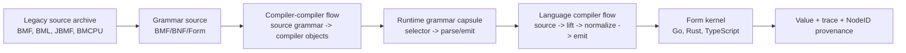

# BMF/BML Compiler Picture

This is the current picture for a modern BMF/BML compiler and compiler-compiler. It is not a new parallel stack. The executable carrier lives in [`form/form-stdlib/compiler.fk`](../form/form-stdlib/compiler.fk); this document is the readable map.

## Shape



The reusable core is the carrier: `compiler-object`. Grammars, stages, flows, language ports, source sections, BMF components, and executable program objects all travel as Form data.

## What The Legacy Source Shows

The local archive at `~/Downloads/Angelic/src/` names the original hierarchy:

- `BMF/`: `Syntax`, `Environment`, `Context`, `Process`, `ParseStream`, `ParseStack`, and parser classes under `container/`, `primitive/`, and `terminal/`.
- `BMF/container/`: `Rule`, `Sequence`, `Branch`, `Repeat`, `Tag`, `RuleCall`, `MethodCall`, `Not`.
- `BMF/primitive/`: `Cut`, `Fail`, `Nil`, `MultiMatch`, `EndOfFile`, `EndOfLine`.
- `BMF/terminal/`: `CharChain`, `CharRange`, `Terminal`.
- `BML/lang/`: the object/runtime model: `Object`, `Instantiator`, `InstanceDefinition`, `InterfaceDefinition`, `MethodDefinition`, `FieldDefinitions`, `BaseDefinition`, `ConstantPool`, `GUID`, natives, arrays, dictionaries, exceptions, IO-adjacent runtime types.
- `CD/Source/Java/JBMF` and `CD/Source/Java/jbml`: the Java JBMF/JBML port, useful as the second legacy implementation for comparison.

The modern Form side already mirrors the core BMF classes in `comp-bmf-*` cells: rule, sequence, branch, repeat, tag, rule call, method call, primitive, char range, char chain, inline, literal, char, process, attribute, syntax.

## Compiler-Compiler Flow

The compiler-compiler flow has five stages:

1. `grammar-source`: grammar text is source, not metadata.
2. `grammar-parse`: grammar text parses into source objects.
3. `grammar-compile`: source grammar objects lower into reusable compiler objects.
4. `dialect-capsule`: a grammar becomes a runtime port by selector.
5. `sibling-proof`: the same grammar carrier walks on Go, Rust, and TypeScript.

This is how BMF becomes the compiler-compiler: a grammar can describe the next grammar, lower to the same carrier, register as a dialect capsule, and be walked by the same kernels.

## Compiler Flow

The language compiler flow has five stages:

1. `source-scan`: source bytes become dialect source objects.
2. `lift`: dialect source objects become shared compiler objects or Form recipes.
3. `normalize`: equivalent shapes map to the same NodeID family.
4. `emit`: output becomes `.fk`, `.fkb`, or a reversible target text surface.
5. `run-observe`: the kernel returns value plus trace/framebuffer evidence.

The reusable language-port contract is:

| Language | Current surface | Status | Shared carrier |
|---|---|---|---|
| BMF | `compiler.fk` BMF second + `bmf-compiler-rules` | proven | `compiler-object` |
| BML | `form-stdlib/grammars/bml.fk` | proven | `compiler-object` |
| Python | `form-stdlib/grammars/python-bmf.fk` + lift/eval path | in motion | `compiler-object` |
| TypeScript | `form-stdlib/grammars/typescript-bmf.fk` | seed | `compiler-object` |
| Go | `form-stdlib/grammars/go-bmf.fk` | seed | `compiler-object` |
| Rust | `form-stdlib/grammars/rust-bmf.fk` | seed | `compiler-object` |
| Java | legacy JBMF archive + future Java BMF port | legacy source | `compiler-object` |
| C# | future C# BMF port | target | `compiler-object` |

The port changes by grammar, lift rules, emitter, and runtime bindings. The core flow does not change.

## First Executable Step

This picture is now executable in Form:

- `compiler-stage`, `compiler-flow`, `compiler-language-port`, and `compiler-picture` are model cells in `compiler.fk`.
- `bmf-bml-compiler-picture` returns the current BMF/BML north-star picture.
- `form/form-stdlib/tests/bmf-bml-compiler-picture-band.fk` proves the invariants across sibling kernels: ten stages, eight language ports, eight shared ports, and two proven ports.

Proof command:

```bash
cd form
./validate.sh form-stdlib/core.fk form-stdlib/json.fk form-stdlib/cache.fk form-stdlib/form-ontology-loader.fk form-stdlib/engine.fk form-stdlib/compiler.fk form-stdlib/tests/bmf-bml-compiler-picture-band.fk
```

Expected result: `112251` with `1 ok, 0 divergent`.

## BML Source Body

The picture also now lives as BML source:

- [`form/form-stdlib/bml/bmf-bml-compiler-picture.bml`](../form/form-stdlib/bml/bmf-bml-compiler-picture.bml) is the compiler/compiler-compiler source body.
- It uses BML classes, interfaces, class templates, generic fields and methods, sections, constants, constructors, property bags, a `syntax` block, and reversible `choose` / `fail` / `save` / `discard` control.
- It names reusable ports for BML, CSharp, Java, TypeScript, Go, and Rust without changing the core flow.
- [`form/form-stdlib/tests/bml-compiler-source-picture-proof.fk`](../form/form-stdlib/tests/bml-compiler-source-picture-proof.fk) parses the BML file and proves 42 structural checks across the Go, Rust, and TypeScript kernels.

Proof command:

```bash
cd form
./validate.sh form-stdlib/core.fk form-stdlib/json.fk form-stdlib/cache.fk form-stdlib/form-ontology-loader.fk form-stdlib/engine.fk form-stdlib/compiler.fk form-stdlib/source-compiler.fk form-stdlib/grammars/bml.fk form-stdlib/tests/bml-compiler-source-picture-proof.fk
```

Expected result: `42` with `1 ok, 0 divergent`.

## Bootstrap Boundary

The target compiler code is BML. Form and s-expression code are only acceptable as the minimum bootstrap/proof carrier needed until the BML compiler can load, compile, and verify itself.

The release direction is:

1. Keep the BML compiler/compiler-compiler body in high-level BML class and template source.
2. Shrink Form/s-expression compiler logic to bootstrap loaders, primitive kernel edges, and sibling proof harnesses.
3. Move parser, model, flow, registry, emitter, and compiler-compiler behavior into BML.
4. Retire non-bootstrap s-expression compiler code once the BML source proves the same behavior through self-hosted compilation.

That means Form remains the witness substrate; BML owns the compiler language.

## Next Refinements

1. Lower the BML source body into canonical compiler objects, not only parsed declarations.
2. Move grammar ports into runtime registry capsules.
3. Complete BMF source body semantic lowering against the original `BMF-grammar.bml`.
4. Lift the BML object model into canonical compiler objects.
5. Extend Python, TypeScript, Go, and Rust grammar ports through the same contract.
6. Add Java and CSharp ports without changing the core flow.

The picture gets more abstract by finding common ground, not by hiding the evidence.
