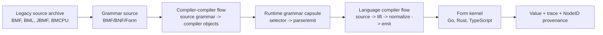

# BMF/BML Compiler Picture

This is the current picture for a modern BMF/BML compiler and compiler-compiler. It is not a new parallel stack. The executable carrier lives in [`form/form-stdlib/compiler.fk`](../form/form-stdlib/compiler.fk); this document is the readable map.

## Shape



The reusable core is the carrier: `compiler-object`. Grammars, stages, flows, language ports, source sections, BMF components, and executable program objects all travel as Form data.

## What The Legacy Source Shows

The local archive at `~/Downloads/Angelic/src/` names the original hierarchy:

- `BMF/`: `Syntax`, `Environment`, `Context`, `Process`, `ParseStream`, `ParseStack`, and parser classes under `container/`, `primitive/`, and `terminal/`.
- `BMF/container/`: `Rule`, `Sequence`, `Branch`, `Repeat`, `Tag`, `RuleCall`, `MethodCall`, `Not`.
- `BMF/primitive/`: `Cut`, `Fail`, `Nil`, `MultiMatch`, `EndOfFile`, `EndOfLine`.
- `BMF/terminal/`: `CharChain`, `CharRange`, `Terminal`.
- `BML/lang/`: the object/runtime model: `Object`, `Instantiator`, `InstanceDefinition`, `InterfaceDefinition`, `MethodDefinition`, `FieldDefinitions`, `BaseDefinition`, `ConstantPool`, `GUID`, natives, arrays, dictionaries, exceptions, IO-adjacent runtime types.
- `CD/Source/Java/JBMF` and `CD/Source/Java/jbml`: the Java JBMF/JBML port, useful as the second legacy implementation for comparison.

The modern Form side already mirrors the core BMF classes in `comp-bmf-*` cells: rule, sequence, branch, repeat, tag, rule call, method call, primitive, char range, char chain, inline, literal, char, process, attribute, syntax.

## Compiler-Compiler Flow

The compiler-compiler flow has five stages:

1. `grammar-source`: grammar text is source, not metadata.
2. `grammar-parse`: grammar text parses into source objects.
3. `grammar-compile`: source grammar objects lower into reusable compiler objects.
4. `dialect-capsule`: a grammar becomes a runtime port by selector.
5. `sibling-proof`: the same grammar carrier walks on Go, Rust, and TypeScript.

This is how BMF becomes the compiler-compiler: a grammar can describe the next grammar, lower to the same carrier, register as a dialect capsule, and be walked by the same kernels.

## Compiler Flow

The language compiler flow has five stages:

1. `source-scan`: source bytes become dialect source objects.
2. `lift`: dialect source objects become shared compiler objects or Form recipes.
3. `normalize`: equivalent shapes map to the same NodeID family.
4. `emit`: output becomes `.fk`, `.fkb`, or a reversible target text surface.
5. `run-observe`: the kernel returns value plus trace/framebuffer evidence.

The reusable language-port contract is:

| Language | Current surface | Status | Shared carrier |
|---|---|---|---|
| BMF | `compiler.fk` BMF second + `bmf-compiler-rules` | proven | `compiler-object` |
| BML | `form-stdlib/grammars/bml.fk` | proven | `compiler-object` |
| Python | `form-stdlib/grammars/python-bmf.fk` + lift/eval path | in motion | `compiler-object` |
| TypeScript | `form-stdlib/grammars/typescript-bmf.fk` | seed | `compiler-object` |
| Go | `form-stdlib/grammars/go-bmf.fk` | seed | `compiler-object` |
| Rust | `form-stdlib/grammars/rust-bmf.fk` | seed | `compiler-object` |
| Java | legacy JBMF archive + future Java BMF port | legacy source | `compiler-object` |
| C# | future C# BMF port | target | `compiler-object` |

The port changes by grammar, lift rules, emitter, and runtime bindings. The core flow does not change.

## First Executable Step

This picture is now executable in Form:

- `compiler-stage`, `compiler-flow`, `compiler-language-port`, and `compiler-picture` are model cells in `compiler.fk`.
- `bmf-bml-compiler-picture` returns the current BMF/BML north-star picture.
- `form/form-stdlib/tests/bmf-bml-compiler-picture-band.fk` proves the invariants across sibling kernels: ten stages, eight language ports, eight shared ports, and two proven ports.

Proof command:

```bash
cd form
./validate.sh form-stdlib/core.fk form-stdlib/json.fk form-stdlib/cache.fk form-stdlib/form-ontology-loader.fk form-stdlib/engine.fk form-stdlib/compiler.fk form-stdlib/tests/bmf-bml-compiler-picture-band.fk
```

Expected result: `112251` with `1 ok, 0 divergent`.

## BML Source Body

The picture also now lives as BML source:

- [`form/form-stdlib/bml/bmf-bml-compiler-picture.bml`](../form/form-stdlib/bml/bmf-bml-compiler-picture.bml) is the compiler/compiler-compiler source body.
- It uses BML classes, interfaces, class templates, generic fields and methods, sections, constants, constructors, property bags, a `syntax` block, and reversible `choose` / `fail` / `save` / `discard` control.
- It names reusable ports for BML, CSharp, Java, TypeScript, Go, and Rust without changing the core flow.
- It now declares the source-lowering architecture in BML: `CompilerCarrier`, `CompilerDeclaration<T>`, `CompilerSectionModel<T>`, `CompilerUnitModel<T>`, `SourceLowerer<TSource,TDeclaration,TCarrier>`, `BMLDeclarationLoweringStage<TDeclaration,TCarrier>`, `BMLSourceLoweringFlow<TSource,TDeclaration,TCarrier>`, and `SelfHostingPlan`.
- It also declares the concrete BML compiler lowerer in BML: `BMLSourceDeclaration`, `BMLSourceParser`, `BMLSourceCarrier`, `BMLCompilerDeclarationLoweringStage`, and `BMLCompilerSourceLoweringFlow`. The parser adapter is the named bootstrap boundary; declaration classification, carrier construction, and source-unit lowering are high-level BML class/template code.
- It names the bootstrap-image ratchet in BML: `BMLCompilerBootstrapImage` records the source path, `.fkb` image path, compiler version, and source hash; `BMLBootstrapRatchet` states that BML source is the authority and that a new `.fkb` promotes only after source compile proof plus sibling proof.
- [`form/form-stdlib/tests/bml-compiler-source-picture-proof.fk`](../form/form-stdlib/tests/bml-compiler-source-picture-proof.fk) parses the BML file and proves 42 structural checks across the Go, Rust, and TypeScript kernels.

Proof command:

```bash
cd form
./validate.sh form-stdlib/core.fk form-stdlib/json.fk form-stdlib/cache.fk form-stdlib/form-ontology-loader.fk form-stdlib/engine.fk form-stdlib/compiler.fk form-stdlib/source-compiler.fk form-stdlib/grammars/bml.fk form-stdlib/tests/bml-compiler-source-picture-proof.fk
```

Expected result: `42` with `1 ok, 0 divergent`.

## BML Source Lowering

The BML source now carries its own lowering model. The proof bridge in Form is intentionally small: it parses the BML source, packages declarations into the shared `compiler-object` carrier, and proves that the unit has four sections:

- `declarations`: every parsed top-level BML declaration.
- `templates`: the generic compiler/source-lowering templates.
- `language-ports`: BML, CSharp, Java, TypeScript, Go, and Rust.
- `bootstrap-boundary`: `SelfHostingPlan`, which states that Form remains only the minimum bootstrap and proof carrier while non-bootstrap s-expression compiler logic is released.

Proof command:

```bash
cd form
./validate.sh form-stdlib/core.fk form-stdlib/json.fk form-stdlib/cache.fk form-stdlib/form-ontology-loader.fk form-stdlib/engine.fk form-stdlib/compiler.fk form-stdlib/source-compiler.fk form-stdlib/grammars/bml.fk form-stdlib/tests/bml-source-lowering-carrier-proof.fk
```

Expected result: `41` with `1 ok, 0 divergent`.

## Concrete BML Source Lowerer

The next refinement is now explicit in BML source, not only in the Form proof bridge:

- `BMLSourceDeclaration` is the typed declaration model exposed by the source parser.
- `BMLSourceParser` is the bootstrap adapter interface that reads BML source until the BML compiler can parse itself.
- `BMLSourceCarrier` specializes `CompilerDeclaration<BMLSourceDeclaration>`.
- `BMLCompilerDeclarationLoweringStage` specializes `BMLDeclarationLoweringStage<BMLSourceDeclaration,BMLSourceCarrier>`.
- `BMLCompilerSourceLoweringFlow` specializes `BMLSourceLoweringFlow<String,BMLSourceDeclaration,BMLSourceCarrier>` and owns template/language-port/bootstrap-boundary classification.
- `ModernBMLCompiler.AttachSourceParser` wires the bootstrap parser into the concrete BML-owned flow.

Form only reads and proves this shape. The compiler architecture it verifies is now in BML classes, templates, generics, and multiline methods.

Proof command:

```bash
cd form
./validate.sh form-stdlib/core.fk form-stdlib/json.fk form-stdlib/cache.fk form-stdlib/form-ontology-loader.fk form-stdlib/engine.fk form-stdlib/compiler.fk form-stdlib/source-compiler.fk form-stdlib/grammars/bml.fk form-stdlib/tests/bml-concrete-source-lowerer-proof.fk
```

Expected result: `31` with `1 ok, 0 divergent`.

The current executable proof goes one step further than structure: it parses the BML source method bodies and dispatches them through the runtime record model. It proves the parser adapter, declaration stage, typed carrier, and language/bootstrap classifiers execute from BML method bodies.

Proof command:

```bash
cd form
./validate.sh form-stdlib/core.fk form-stdlib/json.fk form-stdlib/cache.fk form-stdlib/form-ontology-loader.fk form-stdlib/engine.fk form-stdlib/compiler.fk form-stdlib/source-compiler.fk form-stdlib/grammars/bml.fk form-stdlib/tests/bml-concrete-source-lowerer-execution-proof.fk
```

Expected result: `34` with `1 ok, 0 divergent`.

## Bootstrap Image Ratchet

The bootstrap image is a recoverable compiler body, not a competing source language. The BML source owns compiler architecture and behavior; `.fkb` stores a proven image that can compile that source when the newest source is not yet trusted.

The ratchet is:

1. Keep the previous proven `.fkb` as the seed compiler image.
2. Write compiler improvements in high-level BML classes, templates, generics, sections, and multiline methods.
3. Compile the BML compiler source with the previous `.fkb`.
4. Promote the new `.fkb` only when source compile proof and sibling kernel proof both pass.
5. Recover by compiling BML source with the previous proven `.fkb` until the next image proves itself.

This lets the bootstrap surface become archival. Once a working `.fkb` can compile the BML compiler, new compiler features should land in BML source first; Form and s-expression code remain minimum loaders, primitive kernel edges, and proof harnesses.

Proof command:

```bash
cd form
./validate.sh form-stdlib/core.fk form-stdlib/json.fk form-stdlib/cache.fk form-stdlib/form-ontology-loader.fk form-stdlib/engine.fk form-stdlib/compiler.fk form-stdlib/source-compiler.fk form-stdlib/grammars/bml.fk form-stdlib/tests/bml-bootstrap-image-ratchet-proof.fk
```

Expected result: `26` with `1 ok, 0 divergent`.

## First Compiler Image

The first `.fkb` checkpoint is now proven as a source-derived compiler image record. The image is deliberately modest: it does not yet execute as the self-hosted compiler. It carries BML compiler-source identity, image path, `.fkb` extension, source byte count, parsed declaration count, class count, template count, and interface count in a `BML-COMPILER-IMAGE` node. The proof writes that node to a `.fkb`, reads it back, and verifies NodeID identity plus the loaded fields across Go, Rust, and TypeScript.

This matters because the ratchet now has a real binary checkpoint path. BML source is still authoritative; the `.fkb` is the recoverable image projection. The next promotion step is to replace metadata-only image payload with executable compiler payload, then prove that the image compiles the same BML source.

The runtime record blueprints used by the concrete BML lowerer are now named in `form/form-stdlib/blueprint-registry.json` and regenerated into the kernel bp tables, so compiler image proofs do not depend on anonymous type-99 numbers.

Proof command:

```bash
cd form
./validate.sh form-stdlib/core.fk form-stdlib/json.fk form-stdlib/cache.fk form-stdlib/form-ontology-loader.fk form-stdlib/engine.fk form-stdlib/compiler.fk form-stdlib/source-compiler.fk form-stdlib/grammars/bml.fk form-stdlib/tests/bml-compiler-fkb-image-proof.fk
```

Expected result: `24` with `1 ok, 0 divergent`.

## The Self-Improvement Loop

The pieces above compose into one loop, and every part of it already runs somewhere:

1. **The compiler is a CLI-shippable binary.** `--emit-binary` compiles any workload (the compiler's own preludes included) into one `.fkb` artifact; `--binary` executes it natively on any sibling kernel. The bootstrap image ratchet (above) is this loop applied to the compiler itself.
2. **Hot recipes become host-native code — and the machine code itself is witnessed.** `jit_compile` turns a recipe into machine code — the Go arm emits a real ELF `.so` through the host toolchain (proven mid-band in `form/form-stdlib/tests/host-kernel-metal-band.fk`, verdict 1023 three-way and under `--binary`). `jit_compile_value` carries the full-Value ABI; the Rust arm is an honest 0-stub until cranelift. `scripts/jit_assembly_audit.sh` disassembles the emitted `.so` and verifies in two horizons: minimum gates (arithmetic native inside the plugin, native self-call recursion, value parity) that hold today, and north-star metrics (instruction count, boxed-value traffic, frame size, helper calls) whose measured gap is the de-boxing/inlining road ahead.
3. **A faster version of any part — including the JIT recipe itself — earns its place, never asserts it.** `champion-challenger.fk` flips authority only on proven head-to-head competition; `recognition-router.fk` routes to measured fitness; `kernel-satsang.fk` + `host-kernel-cell.fk` gate the actual swap through declared spec equality and the witnessing circle (verdict 255 three-way and under `--binary`).
4. **The same loop ships any CLI tool.** The API host is the second instance: `kernel-http.fk` + the native kernel router already serve routes natively; an improved handler recipe enters through the same verify → A/B → circle-gated swap.

This is `kernel-self-composition.form`'s `close-self-rebuild-loop` seen from the compiler's side: we can build faster versions of ourselves, verify them, and let them take over only when the competition record says so.

## Choice Receipts

The compiler choice path now has an optional witnessed form:

- `form/form-stdlib/bmf-choice-receipts.fk` wraps the existing indexed
  `apply-indexed-object-rule-set` path and returns a `CHOICE-RECEIPT` plus
  `CHOICE-SIGNATURE` beside the normal match.
- Literal-only BMF object choices are proven safe as `choose_any`; indexed BMF
  and BML compiler rule dispatch is proven as `choose_best`.
- The hot compiler functions keep returning the match directly. Callers ask for
  the receipt wrapper only when they need branch-prediction feedback, alignment,
  knowing, trust, candidate visibility, or selected-branch evidence.

Proof command:

```bash
cd form
./validate.sh form-stdlib/core.fk form-stdlib/json.fk form-stdlib/cache.fk form-stdlib/form-ontology-loader.fk form-stdlib/engine.fk form-stdlib/compiler.fk form-stdlib/grammars/bml.fk form-stdlib/choice-receipt.fk form-stdlib/bmf-choice-receipts.fk form-stdlib/tests/bmf-choice-receipt-band.fk
```

Expected result: `67108863` with `1 ok, 0 divergent`.

### Branch Prediction Reading For Choice Ordering

The branch-prediction literature points to a staged policy rather than one global
reordering rule:

- [Yeh and Patt's two-level adaptive predictor](https://american.cs.ucdavis.edu/academic/readings/papers/yeh91twolevel.pdf)
  shows that short runtime history and per-pattern outcome tables can adapt
  without an offline profile.
- [McFarling's combined predictors](https://ftp.zx.net.nz/pub/archive/ftp.digital.com/pub/DEC/WRL/research-reports/WRL-TN-36.pdf)
  show that different branches favor different predictors, so a chooser can beat
  a single fixed predictor.
- [Jimenez and Lin's perceptron predictor](https://www.cs.utexas.edu/~lin/papers/hpca01.pdf)
  shows that long-history correlations can help when the branch behavior is
  linearly separable, and that confidence is useful evidence rather than just a
  yes/no answer.
- [Seznec and Michaud's TAGE predictor](https://jilp.org/vol8/v8paper1.pdf)
  shows the value of multiple geometric history lengths plus tags to reduce
  aliasing between unrelated histories.

For BMF choice, the semantic boundary comes first:

- `choose_any` remains valid only for alternatives that are order-insensitive,
  such as literal-only object choices proven by `object-choice-direct-safe?`.
- `choose_best` remains the default for compiler rule dispatch, cut/stop
  semantics, ordered fallbacks, and any branch where reordering can change the
  observed parse.
- Learned ordering can only move among semantics-equivalent candidates. The
  receipt should record policy, context key, candidate count, selected path,
  success/fail/silence, skipped count, certainty, and elapsed/pressure evidence.
- Short-term feedback should be cheap and reactive, for example a small
  saturating counter or EMA keyed by choice signature and leading literal. Long-
  term feedback should receive promoted summaries only after repeated confidence,
  with decay when the short-term window disagrees.
- The open questions are aliasing between grammar contexts, phase changes across
  source corpora, observation overhead, and how much evidence is enough before a
  learned preference becomes trusted.

The first safe optimization is below the policy layer: after the object-rule
index has selected an exact or wildcard bucket, every entry in that bucket is
already a candidate for the current first object, so the hot path can execute
those entries directly and keep candidate re-checking for ordered/unknown
fallbacks and receipt visibility.

## Bootstrap Boundary

The target compiler code is BML. Form and s-expression code are only acceptable as the minimum bootstrap/proof carrier needed until the BML compiler can load, compile, and verify itself.

The release direction is:

1. Keep the BML compiler/compiler-compiler body in high-level BML class and template source.
2. Shrink Form/s-expression compiler logic to bootstrap loaders, primitive kernel edges, and sibling proof harnesses.
3. Move parser, model, flow, registry, emitter, and compiler-compiler behavior into BML.
4. Store the last proven compiler image as `.fkb` so recovery never requires expanding bootstrap code again.
5. Retire non-bootstrap s-expression compiler code once the BML source proves the same behavior through self-hosted compilation.

That means Form remains the witness substrate; BML owns the compiler language.

## Next Refinements

1. Replace the metadata-only BML compiler image with an executable compiler payload, then prove that image compiles the same BML source.
2. Execute `BMLCompilerSourceLoweringFlow` through the BML compiler path, then retire the matching Form proof bridge.
3. Move grammar ports into runtime registry capsules.
4. Complete BMF source body semantic lowering against the original `BMF-grammar.bml`.
5. Lift the BML object model into canonical compiler objects.
6. Extend Python, TypeScript, Go, and Rust grammar ports through the same contract.
7. Add Java and CSharp ports without changing the core flow.

The picture gets more abstract by finding common ground, not by hiding the evidence.
