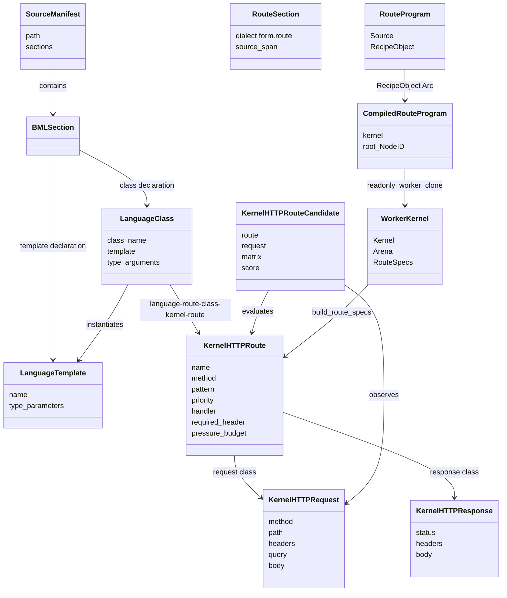

# Source-language-first kernel router architecture

The current working sheet lives in
[`SOURCE_LANGUAGE_KERNEL_ROUTER_TRACKING.md`](SOURCE_LANGUAGE_KERNEL_ROUTER_TRACKING.md). Keep that file
as the live picture of what works, what is tight, and what needs attention next.
This architecture file holds the design shape.

## Decision

Source languages become first-class authored surfaces for the kernel router and
HTTP pipeline. BML is the first exercised dialect, not the name of the runtime
model. Form recipes and cells remain runtime truth. Rust is the host boundary we
have exercised most deeply so far, not the primary kernel and not the definition
of the front door.

There is no primary kernel. Rust, Go, and TypeScript are sibling carriers for
the same lattice semantics. The front door is a role: a kernel accepts an HTTP
carrier, interns request/route/response facts into Form values, walks the same
recipes, and returns the same wire result. A route is not "Rust-native" or
"Go-native"; it is Form-native when any sibling kernel can realize the same
handler cell with the same NodeID-shaped result.

That gives each layer one job:

| Layer | Owns | Does not own |
|---|---|---|
| Source language | Route classes, request/response contracts, templates, generic route families, author-visible HTTP policy | Runtime identity or execution truth |
| Form | Lowered recipes, cells, NodeIDs, route closures, channels, request/response values, HTTP parse/route/dispatch/render in `--form`, attention and candidate selection logic | Process lifecycle, TLS, host file descriptors |
| Host kernel | `serve`/`serve --form` carrier shell, listener binding, accepted-stream queue, worker pool/goroutines, socket handles, route-manifest loading, upstream proxying in compatibility mode, deadlines, binary read/write, opaque host calls | Source grammar, business routes, Form-mode HTTP framing, candidate scoring, route semantics |
| Python upstream | Tail routes not yet native, current FastAPI compatibility bridge and handler port | Front-door identity, route semantics, or high-grammar native credit |

The durable public claim is simple: a route is authored in the highest useful
source language, lowered through Form into content-addressed recipes and cells,
and executed by a sibling kernel. Host kernels expose the smallest boundary
ports and walk Form closures. BML, domain grammars, and future grammars are the
preferred handler authoring surfaces. Python handlers are not special; existing
ones either compile into Form recipes or remain temporary port/fanout bridge
handlers while the compiler/lens path catches up.

Documentation follows the same rule. A Python reference should name one of three
truths: bridge/upstream behavior, operational tooling, or historical evidence.
If a paragraph teaches Python/FastAPI as the runtime destination, rewrite it
toward the Form-native route cell, handler grammar, or sibling-kernel contract.

## Sibling-kernel front-door contract

The native front door must be portable across sibling kernels:

1. **Same Form HTTP stack.** `http-parse.fk`, `http-request.fk`,
   `kernel-http.fk`, `http-server.fk`, `http-render.fk`, `http-socket.fk`, and
   the route manifest are the semantic body. Each host may expose socket/file
   ports differently, but the request/route/response cells are shared.
2. **Same route identity.** A route is addressed by lattice coordinates:
   method, normalized path shape, body class, auth/permission class, and handler
   NodeID. Host-language filenames are not route identity.
3. **Same handler contract.** A handler is a recipe/cell with an input shape and
   output shape. It may be authored in BML, a domain grammar, legacy Python
   compiled to Form, or a Python port call, but the router sees a handler cell.
4. **Same failures.** Parse misses, route misses, method mismatches,
   guard failures, handler failures, and port failures are values with
   coordinates. They are not exceptional side channels.
5. **Same observations.** Each sibling records the same category/handler/guard
   observations so heat can condense gas -> water -> ice consistently: repeated
   route choices become route indexes, repeated guard bundles become compiled
   plans, repeated hot handlers become JIT/native candidates.

The next front-door proof should run through Go. The Go kernel already carries
the substrate, walker, socket ports, `walk_parallel`, `walk_parallel_cached`,
and Go JIT. The Rust path remains useful proof and deploy tissue, but the
architecture should now make Go serve the same `kh-*` stack, then return to Rust
with the sibling deltas visible instead of letting Rust define the shape alone.

## Lattice-native HTTP composition

The usual server stack pays for decisions because it treats routes, guards, and
handlers as mutable host structures. The substrate changes the cost model:

- **Route lookup is a coordinate read.** Once a `kh-request` has method/path/body
  class/auth class coordinates, the route index can be a direct cell lookup:
  `route-key -> handler NodeID`. A switch is free in the relevant sense because
  the choice recipe lands by NodeID, not by scanning endpoint branches.
- **Source `match` is a substrate switch.** BML/Form `match` lowers to
  `RBasic.MATCH / RMatch.SWITCH` (`@1.2.19.1`). Literal scalar arms are compiled
  into a cached `NodeID -> body` table keyed by the match recipe NodeID; identifier
  `_` is the default arm and is distinct from literal string `"_"`. Host-language
  `switch` statements inside Go/Rust/TS walkers are implementation dispatch, not
  user-authored branch semantics.
- **Choice can be parallel.** Candidate routes and guards are non-mutating cells,
  so each branch can run on a sibling worker/goroutine/thread without intercell
  locks. The merge is deterministic: pressure, priority, then NodeID order; never
  "first thread wins."
- **Independent `and` can be parallel.** Method, path, header, auth, body-shape,
  budget, and consent guards run as an unordered conjunction when they have no
  data dependency. First fail returns the failure value and can cancel remaining
  work; all success returns a route-ready value.
- **Fail is structural.** A failed parse, missing route, blocked method,
  malformed body, failed permission, or handler port error is the same class of
  outcome as success: a value that can render as HTTP and teach the route body.
- **Do and undo travel together.** Handler effects should be declared as cell
  deltas with inverse deltas. Primitive operations and cell CRUD can therefore
  carry the same cost surface for do/undo, and a handler can fail after producing
  an undo recipe instead of relying on host exceptions.
- **Observation changes the body.** Runtime heat is not an external metric. It
  is the basis for condensation: hot route keys become indexed cells, hot guard
  bundles become pre-realized plans, hot handlers become JIT/native candidates,
  and cold or never-successful tissue becomes compost candidates.

From this point of view the HTTP stack is not a fixed line. It is a flow graph:

```text
socket bytes
  -> HTTP byte cell
  -> kh-request cell
  -> route-key cell
  -> route-index lookup
  -> parallel guard bundle
  -> deterministic choice merge
  -> handler cell
      -> Form-native recipe
      -> compiled legacy Python recipe
      -> Python port call
      -> any future grammar's lowered recipe
  -> kh-response or kh-failure cell
  -> render/send
  -> observation + optional condensation/JIT
```

The main and only public front door is this native kernel flow. The
compatibility API remains available as a handler port for endpoints not yet
expressible as Form-native recipes, and only as a bridge under the same
route/guard/response/observation contract.

## Go JIT alignment: observation -> plan -> ABI -> dispatch

The Form language contract is clear: hot sequences lower because repeated
observation says they should, and the cache key is the content-addressed Recipe
NodeID. `jit-vector.md` names the shipped base as memoization and the next stage
as typed/native codegen. That means Go JIT growth cannot be endpoint branches in
`jit.go`; it has to be a general lowering pipeline.

The existing Go path proves the first native-code shape:

```text
Recipe body NodeID
  -> emit Go source for the supported subset
  -> go build -buildmode=plugin
  -> plugin.Open("FnI64" / "FnF64")
  -> k.jitCompiledGo[body NodeID]
  -> FNCALL dispatch when the runtime args match the plugin ABI
```

The important distinction is **compiled** versus **dispatched**. A compiled
artifact only means the recipe body lowered to a plugin. It is not performance
evidence until the framebuffer records `observe/go/jit/dispatch-hit` for the
call. The trace JSON still renders `jit-go-dispatch`, but that is now a view of
the same core observation surface rather than the architecture's private proof.

Current Go proof:

- i64 recursive helper: result `[1, 1, 30, 110]` (`jit_compile` success,
  `jit_compiled?` true, two calls), framebuffer records
  `observe/go/jit/dispatch-hit: 2` and no guard misses.
- f64 helper (`min2` called with floats): result `[1, 1, 2.5, 3.5]`
  (`jit_compile` success, `jit_compiled?` true), framebuffer records
  `observe/go/jit/dispatch-hit: 2` and no guard misses. The Go artifact now
  carries scalar i64 and f64 ABIs.
- legacy Python-adapter grounded-cost recipe now executes in Go after sibling
  parity for `_dict_new`/`_get`/`_iter`; the portable BML/Form handler remains
  the preferred source shape because it uses `record_new`/`record_get` and
  validates across the Go/Rust focused probe.

The next Go JIT unit is therefore a **JIT plan**, not another emitter case:

| Stage | Product | Rule |
|---|---|---|
| Observe | framebuffer rows: recipe/cell dispatch, function/native dispatch, choice branch attempt/fail/success by branch order, JIT compile/guard/dispatch by body NodeID | Observer pays the cost; ordinary hot-path runs do not allocate these cells |
| Select | reusable lowering family (`scalar-i64`, `scalar-f64`, `list-fold`, `record-field`, `json-string`) | No endpoint names; the same plan must serve any recipe with the same shape |
| Guard | ABI guard over runtime `Value` kinds and arity | Guard miss falls back to walker and records the miss; it does not panic or silently claim speed |
| Compile | generated Go plugin keyed by body NodeID + ABI + target | Same shape and ABI reuse the same artifact |
| Dispatch | typed call boundary and boxed result | `observe/go/jit/dispatch-hit` is emitted only after the guard succeeds and native code runs |
| Validate | sibling value parity plus trace evidence | A JIT feature is done when value parity holds and dispatch/miss counters explain what happened |

The same rule applies outside JIT. `form-language.md` makes `choose/fail/stop`
and repeated category occurrence part of the language, not profiler decoration.
The kernel observation contract is therefore:

- Recipe and cell dispatch are counted by category coordinates, not by ad hoc
  log labels.
- Choice attempts are counted by branch order; branch fail, branch success, and
  stop/commit are separate framebuffer rows so reordering can be evaluated from
  evidence.
- JIT compile success/fail, ABI guard miss, and dispatch hit are framebuffer
  rows keyed by the recipe body NodeID.
- Trace JSON is a renderer over those facts for CLI use. The framebuffer is the
  architectural surface.

Current Go proof: `(choose (fail) (add 40 2) (stop))` returns `42`; the
framebuffer records two `observe/go/choice/attempt` rows, one
`observe/go/choice/fail` row for branch 1, and one
`observe/go/choice/success` row for branch 2. The branch number is the row line,
so choice ordering is observable where the recipe dispatch is observable.

This mirrors established JIT practice without importing its accidental shape:
[LLVM ORC](https://llvm.org/docs/ORCv2.html) separates program representation,
transform/compile layers, lazy or eager materialization, and concurrent
compilation; [Cranelift](https://cranelift.dev/) centers an explicit IR/backend
boundary suitable for embedders; [Truffle/Graal](https://www.graalvm.org/jdk22/graalvm-as-a-platform/language-implementation-framework/Optimizing/)
treats profiling, specialization, and deoptimization visibility as part of the
optimization workflow. In Form terms those are: recipe NodeID as identity,
lowering plan as water, compiled ABI artifact as ice, and guard/fallback/miss
observations as gas that can keep teaching the body.

The grounded-cost endpoint makes the immediate plan concrete. Its heat is not a
new route-specific compiler. It is reusable Go JIT coverage for f64 comparisons,
left folds over lists, record field access, and string/JSON assembly, each keyed
by recipe shape and proven with dispatch traces.

## Timing scope: what can be optimized here

The `/api/ideas` persistence route now has a native timing sibling,
`/api/_form/ideas-timing`, and a reusable probe,
`scripts/ideas_route_timing_breakdown.py`. The point is not another headline
latency number. The point is to keep optimization claims inside the code path we
can improve.

```text
outside current optimization scope
  process startup
  public internet / Cloudflare / Traefik path
  TCP accept and client response download

inside handler optimization scope
  config lookup
  DB connect / pool acquisition
  request query projection
  summary SQL
  page SQL
  response tree construction
  Form json-emit
  JIT dispatch / fallback / primitive lowering
```

Observed on 2026-06-05 for
`/api/ideas?limit=2&offset=0&sort=marginal_cc` against production Postgres:

| Surface | p50 | p95 | What it includes |
|---|---:|---:|---|
| Public FastAPI HTTP total | `269.859 ms` | `1087.374 ms` | public network/proxy + production FastAPI/service path |
| Local native Go HTTP total | `547.091 ms` | `1303.667 ms` | local loopback + Go `serve` + SSH-tunneled DB + BML handler |
| Native handler-internal total | `555 ms` | `1301 ms` | BML handler only, excluding startup/TCP/client response write |
| Python same-SQL handler total | `412.903 ms` | `434.894 ms` | fresh Python DB connect, same BML SQL, Python dict shaping and `json.dumps` |

Native median split:

| Segment | p50 |
|---|---:|
| connect | `248 ms` |
| summary query | `137 ms` |
| page query | `154 ms` |
| params | `1 ms` |
| shape tree | `5 ms` |
| json-emit | `3 ms` |

Python same-SQL median split against the same tunnel:

| Segment | p50 |
|---|---:|
| connect | `215.906 ms` |
| summary query | `93.528 ms` |
| page query | `101.260 ms` |
| shape dicts | `0.082 ms` |
| json dumps | `0.102 ms` |

The median lesson is plain: first win target is not generic "Python vs Go"; it is
fresh DB connection/ping plus the two SQL reads. The native route currently pays
that every request. A Form-visible Postgres connection/pool cell, or a route
worker that keeps a DB pool across requests, should be measured before deeper
JSON work is claimed as the median bottleneck.

The tail lesson is different. The slowest native timing samples assigned large
pauses to `shape_tree`, `json_emit`, or parameter projection while DB segments
stayed near median. That is substrate allocation/GC/JIT/emitter pressure. The
right follow-up is not an endpoint special case; it is reusable compression for
JSON node construction/emission, dict field access, node introspection, and JIT
coverage of the helpers already hot in framebuffer rows.

## Realized — native HTTP stack end to end (2026-06-05)

The kernel-minimal correction landed as a Form-native HTTP stack. There are now
three distinct serving paths; the architecture stays clear by naming which one is
being used.

### 1. `serve --form`: Form owns the request lifecycle

This is the native HTTP stack:

```text
TcpListener accept
  -> worker_loop
  -> serve_connection_form
  -> socket_register(TcpStream)
  -> kh-serve-conn(conn, routes, registry)
  -> kh-recv-request
  -> kh-serve
  -> kh-request-from-raw
  -> kh-select-route-candidate-for-request
  -> registry handler(kh-request)
  -> kh-serve-response
  -> kh-send-all
  -> socket_close
```

In this mode Rust binds the listener, queues accepted streams, starts worker
kernels, loads the manifest, resolves `kh-serve-conn` plus the top-level
`routes` and `registry` values, registers the accepted stream as a socket handle,
walks the closure, and drops the handle if a recipe returns early. Form owns
receiving bytes, parsing the request, lifting it to `kh-request`, scoring routes,
dispatching the handler, finalizing/rendering `kh-response`, sending bytes, and
closing the connection.

The stack is:

- `http-parse.fk` — CRLF-safe request lexer into HTTP request/header nodes.
- `http-request.fk` — raw request -> `kh-request(method, path, headers, query, body)`.
- `kernel-http.fk` — `kh-request`, `kh-response`, `kh-route`, pressure rows, and
  route-candidate scoring.
- `http-server.fk` — `kh-serve`: parse -> route -> dispatch -> render.
- `http-render.fk` — `kh-response` -> HTTP/1.1 wire string, with framing headers
  as data.
- `http-socket.fk` — `kh-serve-conn` / `kh-serve-listener`, the socket loop over
  the minimal `socket_*` ports.
- `router-routes.fk` — the `--form` route/registry layer; route bodies are still
  placeholders until byte-identical with their Python twins.

Proof already exists at the layer where each claim lives: Go/Rust/TS for the
pure layers (`http-parse`, `http-request`, `http-render`, `http-server`) and a
Go/Rust real-socket band for `http-socket`. The current `kh-serve-conn` reads
until the header terminator, serves one request per connection, renders the body
whole before transport send, and has no fan-out arm. It is therefore correct for
the native GET paths the load balancer sends to it, while request-body streaming,
keep-alive, chunked request bodies, and fan-out remain named work.

### 2. `serve` without `--form`: host-router compatibility path

The older kernel-router path remains useful and live. Rust reads a full
Content-Length request, parses method/path/query/body into a compatibility alist
plus typed `KernelHTTPRequest`, selects `RouteSpec` / `KernelHTTPRoute` /
`KernelHTTPRouteDataRef`, walks the selected Form closure, emits
`KernelHTTPResponse` or the status-tag compatibility shape, and streams unmatched
paths to the FastAPI upstream. This path carries full request bodies, keep-alive,
header-preserving upstream fan-out, and the route-promotion shadow manifest.

It is not the final Form-native HTTP architecture; it is the compatibility and
fan-out carrier while `--form` grows body handling, streaming, and deploy wiring.

### 3. `serve_via_kernel`: FastAPI guest-kernel compute path

The FastAPI routes that call `serve_via_kernel` run their computational core on
the warm PyO3 kernel, but FastAPI still owns socket, route binding, validation,
and response serialization. Those routes increase kernel execution share; they
are not kernel-first HTTP routes.

## Current runtime facts

The live body already has the pieces:

- `form/form-kernel-rust/src/main.rs::cli_serve` is an HTTP listener with two
  paths: the compatibility host-router path, and `--form`, which hands each
  accepted stream to the Form HTTP stack through `kh-serve-conn`.
- `deploy/kernel-router/production-routes.fk` is the compatibility/shadow route
  manifest for byte-identical native route promotion and upstream fan-out.
- `form/form-stdlib/router-routes.fk` is the current `--form` route/registry
  manifest; it proves dispatch but still carries placeholder response bodies.
- `form/form-stdlib/source-compiler.fk` owns `section [form.route]` lowering
  beside the existing `form.bml` and `form.action` high-level source dialects.
  Rust can invoke it at load time, but the grammar and lowering live in
  Form-stdlib, not in the router host.
- `form.bml` now lowers `match ... { ... }` into the shared
  `MATCH.SWITCH` recipe. Go, Rust, and TypeScript execute the same direct
  NodeID-keyed switch semantics; the focused band
  `form-stdlib/tests/source-language-match-switch-band.fk` returns `7` across all
  three kernels.
- `scripts/runtime_surface_report.py --json` currently reads:
  - 785 API routes total.
  - 22 routes call the kernel from FastAPI, 2.8 percent of the API surface.
  - 0 routes are served kernel-first at the live front door.
  - 23 API routes are kernel-first capable in the router manifest.
  - 1,975 CPython code lines remain across the kernel router families, about
    89.8 lines per kernel-served route, plus 18 Python tail functions.
- The current capable API routes are:
  `/api/utils/coherence_weight`,
  `/api/utils/nodeid_distance`,
  `/api/utils/nodeid_compatibility`,
  `/api/utils/weighted_average`,
  `/api/utils/simpson_diversity`,
  `/api/utils/idea_score`,
  `/api/utils/marginal_cc_return`,
  `/api/utils/breath_balance`,
  `/api/utils/shannon_entropy`,
  `/api/utils/softmax_weights`,
  `/api/utils/cost_vector`,
  `/api/utils/value_vector`,
  `/api/utils/grounded_roi`,
  `/api/utils/idea_grounded_cost_sum`,
  `/api/utils/grounded_cost`,
  `/api/utils/grounded_value`,
  `/api/utils/worldview_alignment`,
  `/api/utils/tag_match_score`,
  `/api/utils/coherence_summary_score`,
  `/api/utils/idea_marginal_from_record`,
  `/api/utils/idea_grounding_summary`,
  `/api/utils/concept_match_score`,
  `/api/attention/kernel-runtime`.

The direction is runtime share, not route count. A route that calls
`serve_via_kernel` from FastAPI still leaves routing, binding, validation,
orchestration, and response serialization in CPython. A compatibility
kernel-router route moves the front door out of CPython but still uses Rust HTTP
mechanics. A `serve --form` route moves the request lifecycle for that route into
Form over minimal socket ports.

## Complex endpoint exemplar: `/api/utils/grounded_cost`

`/api/utils/grounded_cost` is the current end-to-end exemplar because it is no
longer a toy scalar route:

- It has structured input pressure: five CSV query arrays plus one scalar,
  paired-length validation, float/int coercion, and list-of-record handler data.
- It has shaped output pressure: six computed floats, three echoed counts, a
  runtime provenance field, and a first-class 422 failure response.
- It has three comparison surfaces in the tree:
  - Python source-reference body for measurement only:
    [`form/form-kernel-ts/seedbank/python-adapter/examples/endpoint_grounded_cost_demo.py`](../form/form-kernel-ts/seedbank/python-adapter/examples/endpoint_grounded_cost_demo.py)
  - compiled legacy Python-adapter recipe:
    [`form/form-kernel-ts/seedbank/python-adapter/examples/endpoint_grounded_cost_demo.fk`](../form/form-kernel-ts/seedbank/python-adapter/examples/endpoint_grounded_cost_demo.fk)
  - sibling-portable BML/Form handler core:
    [`form/form-stdlib/tests/grounded-cost-record-handler-band.fk`](../form/form-stdlib/tests/grounded-cost-record-handler-band.fk)

The focused probe is
[`scripts/grounded_cost_endpoint_probe.py`](../scripts/grounded_cost_endpoint_probe.py).
On 2026-06-05, with 50 specs, 40 commits, and 30 lineage links, it measured:

| Surface | p50 | p95 | p99 | What it includes |
|---|---:|---:|---:|---|
| Python source-reference body | 0.01000 ms | 0.01250 ms | 0.01750 ms | `endpoint_grounded_cost_demo.py` over prebuilt records |
| Python endpoint shape | 0.01292 ms | 0.01588 ms | 0.02083 ms | Python parse/shape/render without HTTP |
| Rust kernel recipe subprocess | 6.27912 ms | 6.48029 ms | 6.48029 ms | inject bindings + fork/exec Rust kernel recipe |
| Go kernel recipe subprocess | 6.72892 ms | 6.96567 ms | 6.96567 ms | inject bindings + fork/exec Go kernel recipe |
| FastAPI kernel-guest HTTP | 3.32067 ms | 3.93542 ms | 3.98592 ms | Uvicorn/FastAPI request -> kernel guest dispatch -> response |
| Native kernel HTTP route | 8.01133 ms | 8.33867 ms | 8.41454 ms | Rust compatibility front door -> Form query parse/body/render |

The probe also showed value parity with runtime provenance ignored and exact 422
parity for the paired-array failure path. This means the endpoint is correct in
both observed success and observed fail shapes, but not yet faster through the
compatibility native HTTP path. That is the useful result: performance attention
belongs on handler lowering, warm/inline carriers, and JIT/vectorized fold
coverage, not on correctness guessing.

The Go JIT readout is precise:

- The legacy Python-adapter recipe now runs in Go, with value parity to Python.
  Its subprocess p50 is still ~6.7 ms because this path is fork/exec plus a
  cold walker, not a warm in-process native handler.
- The JIT compile pass over the endpoint's 12 discovered helper names produced
  2 framebuffer compile successes, 6 framebuffer compile fails, and 4 unbound
  nested loop helpers. That is down from the earlier hard Go setup failure at
  `_dict_new`.
- The reusable Go JIT proof dispatches for both scalar ABIs: i64 returns
  `[1, 1, 30, 110]`, f64 returns `[1, 1, 2.5, 3.5]`, and both record
  `observe/go/jit/dispatch-hit: 2` with `guard-miss: 0`.
- The medium fixture trace still shows the handler heat: 5,389 walks, `_plus`
  252, `_get` 210, `len` 174, `head`/`tail` 170 each, plus 120
  `record_new`/`make_nodeid` calls. Those are immediate Go JIT plan families:
  left list folds, dict/record field access, and response string assembly.

The sibling-portable handler band is the important source-language correction.
The legacy Python-adapter recipe uses `_dict_new`/`_get`/`_iter`; Go now carries
those as bridge parity, but they should not become the handler grammar. The
BML/Form handler core uses `record_new`, `record_get`, `head`, `tail`, and
numeric primitives, and the focused probe validates it across Go and Rust:

```
cd form && ./validate.sh form-stdlib/core.fk form-stdlib/tests/grounded-cost-record-handler-band.fk
# -> [4.75, 6.75, 2.25, 0.75, 6.75, 7.75]
```

So the next aligned move is not "make Python special." It is to let a handler
registry row choose among:

1. a BML/domain-grammar handler written directly in the portable record shape,
2. a compiled legacy Python recipe when it lowers to the portable shape, or
3. a Python port call as a temporary bridge under the same `kh-request ->
   kh-response` contract.

## BML persistence catalog: `/api/ideas?query=kernel&limit=4`

`/api/utils/grounded_cost` pressures a medium numeric handler. `/api/ideas`
pressures a wider native path: typed HTTP request cells, query defaults,
persistence connection, SQL row projection, scoring, pagination, JSON recipe
construction, Form JSON emission, and `kh-response` framing.

The source artifact is a BML front-door catalog, not a Go/Rust/Python route
file:

- [`deploy/front-door/api.bml`](../deploy/front-door/api.bml) defines the
  `api_ideas` BML handler and `IdeasIndexRoute` route class.
- [`form/form-stdlib/kernel-http.fk`](../form/form-stdlib/kernel-http.fk)
  supplies typed query helpers (`kh-query-value-or`, `kh-query-int-or`,
  `kh-query-bool-or`).
- [`form/form-stdlib/json.fk`](../form/form-stdlib/json.fk) owns JSON node
  constructors and `json-emit`; the kernel does not own JSON layout.
- [`form/form-kernel-go/server.go`](../form/form-kernel-go/server.go) now loads
  source-authored manifests through the Form source compiler and passes typed
  `kh-request` values to `kh-route` handlers.
- `idea-sort-value` uses BML `match`, which lowers to `MATCH.SWITCH`; route sort
  choice is therefore a substrate switch table, not a nested handler-local
  `if/else if` ladder.

Current contract boundary: this catalog is a read-only graph-backed list over
`graph_nodes(type='idea')`. It carries the portfolio query parameters that can
be represented without Python service side effects (`query`, `limit`, `offset`,
`sort`, `tags`, `include_internal`, `only_unvalidated`, `curated_only`,
`pillar`, `workspace_id`). Python's ensure-on-read step and `lang` projection
remain outside this catalog until those flows have native cells or explicit port
handlers.

Go route-load command:

```bash
cd form/form-kernel-go
go run . serve --port 19086 \
  --config ~/.coherence-network/secrets/form-kernel-postgres-tunnel.json \
  --stdlib ../form-stdlib ../form-stdlib/json.fk ../../deploy/front-door/api.bml
```

Observed load result:

```text
form-kernel-go serve: source manifest compiled via ../form-stdlib to Form recipe object
form-kernel-go serve listening on http://127.0.0.1:19086
```

Production credential memory now lives in
[`docs/PRODUCTION-SUBSTRATE.md`](../docs/PRODUCTION-SUBSTRATE.md). The live
database is the Hostinger compose Postgres service. Credentials were found in
the VPS config path and in a local `0600` kernel overlay; Railway/Supabase are
not the current production DB path.

Direct DB proof on 2026-06-05:

```text
coherence|public|1656
```

The graph moved during the same session; the native and public route timing
probes later returned `pagination.total=1659`. Counts are live data, not a fixed
fixture.

Local curl through the Go kernel, local overlay, and SSH tunnel reaches the
BML route and production Postgres:

```bash
curl -i -sS 'http://127.0.0.1:19086/api/ideas?query=kernel&limit=2&sort=marginal_cc' \
  -H 'Accept: application/json'
```

```text
HTTP/1.1 200 OK
Content-Type: application/json
X-Form-Router: native-kernel-go

{"ideas":[{"id":"a86dc7ee-7810-459b-b89e-16499a8bad9c","name":"Substrate as Render Fabric",...}],"summary":{"total_ideas":5,...},"pagination":{"total":5,"limit":2,"offset":0,"returned":2,"has_more":true}}
```

The successful `query=kernel` response is intentionally not an apples-to-apples
FastAPI parity call: public FastAPI `/api/ideas` does not accept a free-text
`query` or `search` parameter on the list endpoint today. Native BML does. For
latency comparison, use no free-text parameter:

```text
native_go_local_tunnel /api/ideas?limit=2&sort=marginal_cc:
  status 200, total 1659, first "The network as self-aware sensing organism"
  p50 551.986 ms, p95 630.708 ms, mean 559.971 ms

python_public_fastapi /api/ideas?limit=2&sort=marginal_cc:
  status 200, total 1659, first "The network as self-aware sensing organism"
  p50 261.254 ms, p95 1117.920 ms, mean 497.639 ms
```

The native path is local loopback plus an SSH tunnel to the production Postgres;
the public path includes Cloudflare/public network and the production FastAPI
deployment. Treat these as directional engineering readings, not a final
production topology benchmark.

Framebuffer/JIT observation now runs through the BML catalog, not a Go
side-channel:

```bash
curl -sS -H 'Accept: application/json' -H 'X-Form-Observe: 1' \
  'http://127.0.0.1:19086/api/_form/ideas-observation?limit=2&sort=marginal_cc&event_limit=50000'
```

Observed on 2026-06-05 for `limit=2&sort=marginal_cc`:

```text
status=200
body_bytes=4226
framebuffer_event_rows=36141
framebuffer_count_rows=132
events_returned=36141
top rows:
  observe/go/recipe-dispatch IDENT       10431
  observe/go/recipe-dispatch FNCALL       9157
  observe/go/recipe-dispatch COND.IF_ELSE 2935
  observe/go/recipe-dispatch COMPARE.EQ   1847
  observe/go/native-dispatch str_concat    962
  observe/go/native-dispatch head          750
  observe/go/native-dispatch tail          726
```

The warmed in-kernel observation route keeps warm-up and measurement inside one
worker:

```bash
curl -sS -H 'Accept: application/json' -H 'X-Form-Observe: 1' \
  'http://127.0.0.1:19086/api/_form/ideas-observation?limit=2&sort=marginal_cc&event_limit=1&warm=40'
```

That returned `21` `compile-failed` JIT rows, `75` `warming` rows, and `0`
`dispatch-hit` rows. The misses are now cleanly attributed: list-valued
parameters need a list ABI; string/JSON/node primitives such as `str_concat`,
`str_len`, `scan_run`, `intern_node_at`, `_dict_get`, and `node_category` need
general lowering plans. Invalid generated-Go build failures for list operations
were hardened into early unsupported-subset reasons.

Next walked pass on 2026-06-05:

- Go JIT now has a shared value ABI for list/string-shaped recipes, beside the
  existing scalar `i64` and `f64` ABIs.
- Value-shaped recipes are classified before emission, so scalar plugin source
  is not generated for list-returning/list-consuming bodies.
- `jit-stats` now shows real route-level compression: `15` `compile-failed`
  rows, `75` `warming` rows, `6` `compiled` rows, and `6` `dispatch-hit` rows
  after `warm=40`.
- The dispatch-hit bodies recorded `2034`, `1451`, `2674`, `1116`, `788`, and
  `670` hits in the observed run.
- Remaining misses no longer point at "needs list ABI"; they point at the next
  real families: scanner lowering (`scan_run`), dict/field access (`_dict_get`),
  substrate write/introspection (`intern_node_at`, `node_category`,
  `node_children`, `node_type`), numeric trivial construction
  (`intern_trivial_float`), and JSON emitter helpers.
- Fresh 40-request timing did not yet improve median latency:
  native Go local tunnel `p50=560.926 ms`, `p95=748.992 ms`; public FastAPI
  `p50=263.719 ms`, `p95=1162.181 ms`.

Next walked pass in the same session:

- Go JIT now lowers static Form helper families through the value ABI, so a hot
  root recipe can emit sibling helper functions such as scanner/string helpers
  into the same plugin instead of stopping at self-recursion.
- The value ABI now covers `scan_run`, `substring`, `char_at`, `ord`,
  `byte_to_str`, and `str_eq`. This keeps scanner/string work in Form while
  allowing the repeated recipe shape to condense.
- `form/validate.sh` was fixed to rebuild the Go kernel when any Go source file
  changes, including `jit.go` and `jitabi/*.go`; the previous staleness check
  only noticed a few named Go files.
- Warmed `/api/ideas` after `warm=40`: `11` compile-failed rows, `76` warming
  rows, `9` compiled rows, `8` dispatch-hit rows, and `26394` framebuffer event
  rows.
- `scan_run` disappeared from top failures. New top pressure: `node_value`,
  logic ops, `_dict_get`, `intern_node_at`, `intern_trivial_float`,
  `node_category`, `node_children`, and `node_type`.
- Fresh 40-request timing: native Go local tunnel `p50=564.986 ms`,
  `p95=601.781 ms`; public FastAPI `p50=265.967 ms`, `p95=1090.011 ms`.
  Tail latency tightened; median remains dominated outside this helper pass.

Switch observability proof for the same primitive:

```text
go run . trace --expr '(do (match "marginal_cc" "marginal_cc" 1 _ 2) (match "other" "marginal_cc" 1 _ 2))'
-> result 2
-> match_lookups=2, match_hits=1, match_defaults=1, match_misses=0
-> framebuffer rows: observe/go/match/hit=1, observe/go/match/default=1
```

The next measurable exit is not "make the route real" anymore; it is cost
compression: add general list/string/JSON/node lowering plans until the warmed
observation reports dispatch hits and fewer failed bodies on this same route.

## Target topology

```
client
  |
  v
native kernel front door
  |
  +-- load-balanced native path -> serve --form
  |     -> kh-serve-conn
  |     -> kh-request / kh-route / kh-response
  |     -> response with X-Form-Router: native-kernel
  |
  +-- compatibility front door -> serve
        +-- native route present -> Rust host-router walks Form handler
        |     -> response with X-Form-Router: native-kernel
        |
        +-- native route absent -> upstream FastAPI
              -> response with X-Form-Router: fanout-python
```

The source-authored manifest is the source entry. The runtime manifest is a
Form cell set with a top-level `routes` binding. In `--form`, `kh-serve` reads
that binding directly as `kh-route` rows plus a `registry` of handler closures.
In compatibility mode, `build_route_specs` consumes path/closure rows, direct
`KernelHTTPRoute` rows, and `KernelHTTPRouteDataRef` rows. The authored
language/Form layer owns method, pattern, priority, required header, handler
name, and pressure budget; Rust resolves host-boundary closures only for the
compatibility path.

## Routing flow axes

There is no separate class of "source route" versus "production route." There are
only route layers that eventually yield Form-native values.

Authoring/loading axis:

- A raw Form manifest is read as `.fk`, walked, and resolved into route values
  plus handler closures.
- A source-authored manifest runs through a source pipeline first. The current
  `section [form.route]` path uses the Form source compiler, but the requirement
  is only that the pipeline returns Form-native route values and handler
  recipes/closures.
- A text-first route can arrive as `.fk` source that the kernel reads and walks.
- A binary-first route can arrive as already-emitted Form recipe bytes loaded
  through Form binary readers when the route crosses a file, socket, process, or
  external-language boundary. Inside one process, an existing Form object graph
  should be carried by reference.

Request routing axis:

- A `--form` native route is a request that reaches `kh-serve-conn`, matches a
  `kh-route`, dispatches a registry handler, and returns a rendered
  `kh-response`.
- A compatibility native route is a request that matches a Rust-resolved route
  spec and executes a Form closure in the kernel.
- A fanout route is a request whose compatibility route value is not present
  yet, so the host forwards it upstream.
- A local-control route is owned by the router boundary, such as health or
  local error responses.

Any additional layer is part of the route when it is expressed as Form-native
recipes, cells, or compiler-lens values. BML is a source surface. BMF is the
lens and translation layer. Form recipes and cells are the runtime truth. `.fk`
text and `.fkb` bytes are carriers, not the definition of the route.

## Route object hierarchy

Final design: the authored language creates high-level cells; the compiler lens
returns Form recipes; the router carries a compiled Form object graph by
reference; each worker walks that graph in an isolated kernel.



Current implementation anchors:

- `form/form-stdlib/bml-source.fk` names reusable BML source cells such as
  typed template use and route call source objects before any dialect chooses
  what they mean.
- `form/form-stdlib/source-compiler.fk` walks full `section [form.bml]` and
  `section [form.route]` bodies through the BML line/block compiler, consumes
  those source cells for route-domain lowering, and returns Recipe objects through
  `fsc-compile-section-recipe`.
- `form/form-stdlib/language-model.fk` defines `LanguageTemplate`,
  `LanguageClass`, and `language-route-class-kernel-route`. Their runtime type
  tags are compact numeric IDs, not repeated type-name strings. BML is one
  dialect that can emit these cells; future grammars should emit the same model.
- `form/form-stdlib/kernel-http.fk` defines `KernelHTTPRequest`,
  `KernelHTTPResponse`, `KernelHTTPRoute`, and `KernelHTTPRouteCandidate`.
  Their value tags are numeric IDs (`43001`..`43007`) so the class hierarchy is
  carried compactly while route decision flow remains visible. `43007` is
  `KernelHTTPRouteDataRef`, the bridge from source-language route class flow
  into compact route table data.
- `form/form-kernel-rust/src/main.rs` stores the compiled object graph as
  `CompiledRouteProgram { kernel, root }` and carries it as
  `RouteProgram::RecipeObject(Arc<CompiledRouteProgram>)`.
- `build_worker_kernel` uses `readonly_worker_clone()` for that route program,
  walks the root `NodeID`, builds route specs, and `handle_request` invokes the
  selected Form closure.
- `deploy/kernel-router/production-routes.fk` authors `/health` as a BML
  `RouteCell<KernelHTTPRequest, KernelHTTPResponse>` template/class hierarchy.
  The `HealthRoute` class owns a readable `handle(request)` method and binds
  `route = route_data(health, handle);`, so method/path/priority/budget load
  from `deploy/kernel-router/production-routes-data.json` while handler flow
  stays in the class.

End-to-end request proof shape:

1. `serve --routes deploy/kernel-router/production-routes.fk --stdlib form-stdlib`
   sees a `section [form.route]` source entry.
2. The main thread calls the Form source compiler and receives a Recipe object
   `NodeID`, not lowered route text.
3. The compiled section object is imported into one `CompiledRouteProgram`
   kernel graph and stored behind `Arc`.
4. Each worker clones that object graph, walks the root, and resolves the
   top-level `routes` binding.
5. The `/health` request selects the source-authored `KernelHTTPRouteDataRef`,
   resolves it to a route spec, invokes the lowered `HealthRoute_handle`
   closure, and returns `X-Form-Router: native-kernel` with body `ok`.

What the hierarchy decides:

- `LanguageTemplate` proves the source has a generic route family.
- `LanguageClass` binds that family to request/response types and a route value.
- `KernelHTTPRouteDataRef` keeps route table data out of recipe source where a
  data carrier exists.
- `KernelHTTPRoute` is the executable route declaration the router can inspect
  after data refs are resolved.
- `KernelHTTPRouteCandidate` carries the multidimensional choice matrix
  (`method`, `path`, `header`, `budget`) and the score used by selection.
- `RouteProgram::RecipeObject` chooses the in-process object carrier instead of
  source reparsing or route serialization.

What changed in the second pass: `/health` route name, method, path pattern,
required header, priority, and pressure budget now live in a file-backed JSON
route-data carrier. The source recipe keeps class identity and handler flow. What
still does not fit the final bar: most production routes still use path/closure
rows, the type IDs are mirrored in Form and Rust instead of generated from one
registry, and the JSON carrier is host-decoded instead of exposed as a
Form-visible `KernelRouterConfig` cell. The first policy tissue is now present:
`kh-channel-policy` carries method invitation, method bridge pressure, no-body
methods, `Allow`, and named cache/compression/stream/identity/authorization
axes. The remaining route-data JSON and deployment/runtime tunables still need
to move into the same config body.

## Source-Language Authoring Contract

A source route declaration lowers to two Form products:

1. A handler closure in the `routes` list consumed by
   `form-kernel-rust/src/main.rs::build_route_specs`.
2. A route cell carrying method, path, request class, response class, handler
   cell, source path, and migration state.

The route cell is the durable identity. The path string is an HTTP lookup key.

Rules:

- Source route declarations use registered Blueprint names. Unknown route,
  request, response, channel, or body class names fail through the existing
  registry discipline in `form/user-blueprint-registry.md` and
  `form/form-stdlib/form-ontology-loader.fk`.
- Generic parameters are authoring-time names for Form Blueprints and Recipe
  shapes. After lowering, no dialect-specific route object remains in the
  runtime.
- Source-language code can call Form functions directly where the dialect lens
  exposes them. The compiler does not introduce Python adapters.
- Generated response bodies must be byte-for-byte compatible with the existing
  HTTP contract before a route leaves the fan-out tail.

## Compiler Lens Contract

The compiler is part of the reasoning surface. It must expose the structure it
uses to lower BML, not only the lowered Form text.

`form/form-stdlib/compiler-lens.fk` defines the first BML-authored lens values:

| Value | Carries |
|---|---|
| `CompilerLensSurface` | surface name, grammar, abstraction level, human component, machine component |
| `CompilerLensSourceMap` | source surface, target surface, source span, target node, fidelity |
| `CompilerLensDependency` | owner, target, relation, strength |
| `CompilerLensTranslation` | source surface, target surface, direction, reversibility, lossiness |
| `CompilerLensDiagnostic` | severity, concept, source span, message, repair |
| `CompilerLens` | the surface plus its maps, dependencies, translations, diagnostics |

Every new source-language/BMF compiler step should produce two outputs:

1. Executable Form recipes/cells.
2. A compiler lens value that lets a human or agent inspect what changed, why it
   changed, what depends on it, and how to translate in the other direction.

That lens is how the compiler helps maintenance:

- Dependency edges tell us which route templates, request cells, response cells,
  and route handlers move when a class changes.
- Source maps let diagnostics point to the source-language concept, not only the lowered
  Form expression.
- Translation records keep BMF bidirectionality explicit: source to Form, Form
  to source, and cross-surface movement are all ordinary lens directions.
- Human and machine components travel together, so a surface can be readable
  for us and precise for the kernel at the same time.
- Structure scoring gives attention a measurable way to prefer high-level concepts
  that preserve intent over lower-density positional route lists.

The BML compiler-lens bridge now links to existing BMF contract values through:

- `CompilerLensBmfSurfaceLink`
- `CompilerLensBmfLensLink`
- `CompilerLensBmfAlignment`

Those links preserve the referenced BMF surface and lens contracts as Form
values. Structural validators compare the linked contract's domain, lens, and
surface against the expected BMF identities, so the compiler lens can reject a
mismatched translation instead of only describing one.

## Working goal and exit criteria

Current goal: make source languages plus BMF live authored lenses for
kernel-first HTTP, with Form as runtime truth and Rust as the host boundary.
New work is aligned when it moves a route, compiler step, channel, or
measurement closer to this loop:

```
source language
  -> BMF compiler lens with source maps and contract links
  -> Form recipes, cells, routes, channels, attention values
  -> kernel execution
  -> live observations
  -> BMF reverse or alternate lens back to source surfaces
```

Valid exit criteria for the next delivery slice:

1. A gap is named with exact code references and classified as aligned,
   side-quest, or temporary friction.
2. At least one aligned gap is closed in BML/Form/sibling host code or a
   load-bearing architecture contract.
3. The closure is validated by real computation across the available Form
   kernels or by a live router measurement, not by mock values.
4. The result preserves information fidelity: matrices, contract values,
   source maps, response shapes, or channel payloads stay structured until a
   lower-dimensional projection is required by an existing boundary.
5. The next gap has a measurable exit criterion and an explicit answer to:
   "does this move source languages/BMF toward live, bidirectional, measurable kernel
   execution?"

Current gap map:

| Gap | Alignment | Exit criterion |
|---|---|---|
| Runtime grammar discovery does not emit compiler-lens evidence | Aligned | Loading a runtime grammar plugin derives one `CompilerLensBmfAlignment` with source/form surface links and parse/emit translations from the resolved binding. |
| Source compiler writes lowered output without compiler-lens source maps | Aligned | Each compiled section yields a `CompilerLensSourceMap` whose span matches the source range and whose target node matches the compiled section node. |
| Source-language route authoring now has readable template/class blocks | Aligned | `section [form.route]` supports `template RouteCell<TRequest, TResponse> { member ... }` plus `class ... { def handle(...) { ... } route = route_data(...); }` and lowers that hierarchy to `LanguageTemplate`, `LanguageClass`, and executable handler closures. |
| Router selection is `KernelHTTPRoute`-aware and exposes the selected candidate as Form tissue | Aligned | `serve` carries `KernelHTTPRoute` rows, honors method mismatch, wildcard path, priority, required headers, and pressure budget, and passes selected `KernelHTTPRouteCandidate` plus pressure rows into native handler context. |
| Native handler input carries both compatibility alist and typed request tissue | Aligned | A native route receives `__kernel_request__` as `KernelHTTPRequest(method, path, headers, query, body)` with typed header and field rows while existing alist handlers keep serving current routes. |
| Native handler output can return `KernelHTTPResponse(status, headers, body)` | Aligned | `serve` emits exact status/header/body for a non-200 native route, including `Content-Type` and filtered end-to-end headers, while preserving the older status-only `respond` shape. |
| Native socket channels do not yet carry typed recipe bytes | Aligned | A BML/Form channel abstraction round-trips `recipe_to_bytes -> send -> recv -> bytes_to_recipe` without string loss. |
| Router measurements are path-count only and process-local | Aligned | `/api/attention/kernel-runtime` reports per-path count, latency, status/error, bytes, native/fanout split, and candidate ranking from live traffic. |
| Production route manifest is mixed: `/health` is `form.route` `RouteCell`-authored, utility routes remain Form-authored | Temporary friction | Convert the next route only when a source pipeline returns the same Form-native route values and handlers and serves identical responses with source entry observability. |
| Go JIT/native optimization lacks list/dict/record fold plans | Aligned | The grounded-cost probe reports Go framebuffer dispatch, not only compile-state, for at least one reusable list-fold or record-field plan, with guard misses and walker-continuation reasons visible. |

## HTTP classes

| HTTP class | Native input shape | Native response shape | Current gate |
|---|---|---|---|
| `QueryJson` | Query alist, decoded by `parse_request_line` | JSON text from Form, `Content-Type: application/json` | Active for promoted `/api/utils/*` routes |
| `FormPostJson` | Query alist plus `application/x-www-form-urlencoded` body pairs from `parse_request_body` | JSON text or scalar text | Ready for routes whose body is flat form data |
| `RawJsonBody` | Query alist plus raw `__body__` string | JSON text | Ready for body length and raw-string handlers |
| `StructuredJsonBody` | JSON body parsed to Form records/cells | JSON text from Form records/cells | Gate: structural JSON-to-Form marshalling |
| `HeaderAware` | Query/body alist plus typed request header cells | JSON/text | Gate: native handler header map; fan-out already forwards headers |
| `StreamOrSse` | Channel-backed message stream | chunk/SSE response | Gate: channel-to-HTTP streaming class and backpressure |
| `HostEffect` | Request cell plus declared host port | JSON/text plus audit trace | Gate: explicit port cell, idempotence class, failure transcript |
| `FanoutTail` | Full HTTP request to upstream | Upstream response relayed | Active for unmatched routes |
| `LocalControl` | Router-owned context only | text/JSON control response | Active for `/health` and router-local errors |

The first class to migrate is `QueryJson` because it has the smallest
marshalling surface and the current production manifest already carries it.
`StructuredJsonBody`, `StreamOrSse`, and `HostEffect` are real runtime classes,
not reasons to keep all routing in Python.

## Router generics and templates

The route source language owns reusable route shapes. Other dialects can emit
the same route template cells. The minimum template set is:

| Route template | Lowers to | Use |
|---|---|---|
| `Route<Method, Path, Request, Response>` | `RouteCell` plus `(path, handler)` | Base route identity |
| `QueryJson<Path, QueryCell, ResponseCell>` | `Route<Query.GET, Path, QueryCell, JsonResponse>` | `/api/utils/*` family |
| `FormPostJson<Path, FormCell, ResponseCell>` | `Route<Query.POST, Path, FormCell, JsonResponse>` | Flat body posts |
| `RawJsonPost<Path, BodyCell, ResponseCell>` | `Route<Query.POST, Path, RawBody, JsonResponse>` | Raw JSON body handlers |
| `AttentionRoute<Path, MetricsCell, ResponseCell>` | Route over router context metrics | `/api/attention/kernel-runtime` |
| `ChannelRoute<Path, MessageCell, AckCell>` | Route over `CHANNEL-MSG` payloads | request/agent transport surfaces |

Template expansion happens in Form-stdlib, not Rust. Rust sees only lowered Form
source and a `routes` binding. Template names, request classes, and response
classes become cells so candidate selection and runtime telemetry can query the
route surface by shape rather than by filename.

## Telemetry contract

Every response already carries the top-level route verdict:

- `X-Form-Router: native-kernel`
- `X-Form-Router: fanout-python`
- `X-Form-Router: native-kernel-error`
- `X-Form-Router: local-control`

Native handlers also receive router context pairs prepended to the request
alist:

- `__request_method__`
- `__request_target__`
- `__request_path__`
- `__router_native_route_count__`
- `__router_observed_path_count__`
- `__router_observed_native_route_count__`
- `__router_observed_fanout_path_count__`
- `__router_total_requests__`
- `__router_native_requests__`
- `__router_fanout_requests__`
- `__router_local_control_requests__`
- `__router_native_error_requests__`
- `__router_upstream__`, `__router_upstream_host__`,
  `__router_upstream_port__`, `__router_upstream_base_path__`

The durable observation cell is `__router_observation__`. It is a Form dict with:

- `fanout_path_counts`: rows shaped as `{path, count, source}` sorted by request
  count descending and path ascending.
- `next_bml_candidate`: the current route candidate shaped as
  `{path, count, source}`.

The flat `__router_next_bml_candidate_*` keys may stay during the branch for
compatibility with scalar handlers, but the BML architecture reads the structured
observation cell.

The authored BML layer must not duplicate those counters. It reads them through
Form, projects them through `form/form-stdlib/attention.fk`, and emits route
attention records. `scripts/runtime_surface_report.py` remains the static
route-share readout. `scripts/native_route_goal_loop.py` is the traffic-weighted
promotion readout: it reads `source=web_api` endpoint summaries, overlays the BML
front-door catalog plus Form native manifest, writes
`docs/system_audit/native_route_goal_state.json` on `/loop`, and selects the next
route until 90% of observed web API traffic is high-grammar native.
`scripts/kernel_attribution_report.py` remains the recipe/cell activity readout.
The public telemetry headline is:

```
kernel-first served routes / total routes
kernel-first capable routes / total routes
request share by X-Form-Router
CPU-time share by X-Form-Router
top observed fan-out path by request count
```

## Candidate selection matrix

Candidate selection is a Form route over measured runtime facts. BML authors the
policy surface; Form computes the score.

| Signal | Source | Weight |
|---|---|---:|
| Request share | `X-Form-Router` access logs and router counters | 0.25 |
| Existing kernel recipe coverage | `scripts/kernel_attribution_report.py` route data | 0.20 |
| Request class readiness | HTTP class table above | 0.15 |
| Response fidelity readiness | byte-for-byte body and content-type comparison | 0.15 |
| Host-boundary cleanliness | no new Rust semantics, explicit ports only | 0.10 |
| Rollback simplicity | removing one route binding returns to fan-out | 0.10 |
| Runtime payoff | native latency and CPython lifecycle avoided | 0.05 |

Selection bands:

| Score | Action |
|---:|---|
| 85-100 | Author source route and add it to the native manifest |
| 70-84 | Author source request/response cells, keep route fanned out until one gate closes |
| 50-69 | Keep in fan-out tail, add telemetry and route shape metadata |
| 0-49 | Keep in Python upstream; revisit when runtime data changes |

Hard stops override the score:

- Native response cannot match status, body, and content type.
- Request requires structured JSON and the route has no structural body cell.
- Route depends on streaming/SSE without a channel-backed HTTP class.
- Route performs host effects without a declared port cell and audit trace.
- Route requires native header access before `HeaderAware` lands.

## Channels

Channels are Form recipes, not sidecar queues. The existing carrier is
`form/form-stdlib/channel.fk`:

- `CHANNEL-V0` holds ordered `CHANNEL-MSG` children.
- `channel-message` wraps a payload recipe.
- `channel-append` writes the next channel state.
- `channel-read` and `channel-read-since` read message recipes.
- `form/form-stdlib/tests/channel-bml-band.fk` shows BML-authored code calling
  the channel transport functions.

The router uses channels for three concrete flows:

1. Candidate flow: observed fan-out path events become `CHANNEL-MSG` payloads
   carrying path, method, count, request class, response class, and time window.
2. Attention flow: `/api/attention/kernel-runtime` projects router counters into
   attention axes and writes route-attention cells.
3. Agent/runtime flow: request-side or agent-side messages cross as content-
   addressed payloads before they become HTTP streaming classes.

`CHANNEL-V0` is single-writer and whole-file rewrite. That is enough for local
candidate and attention channels. Multi-writer or durable streams require a
stronger channel class before they can carry public streaming HTTP.

## Host-boundary constraints

Host kernels may:

- accept TCP connections, queue accepted streams, and register socket handles;
- in compatibility mode, parse method, path, query, headers, and body into the
  current request alist and frame HTTP/1.1 responses;
- enforce host-level size and deadline boundaries;
- maintain worker-local `Kernel + Arena` instances;
- load raw Form source and in-memory Recipe object graphs;
- call the Form source compiler when a BML section is supplied;
- invoke a compiler from source text and return a Recipe NodeID through generic
  primitives such as `compile_source_section` and `compile_source_text`;
- in compatibility mode, proxy unmatched requests to the upstream with header
  hygiene;
- expose measured router context to Form handlers where the compatibility path
  owns those measurements.

Host kernels may not:

- implement BML grammar or route templates;
- choose migration candidates;
- encode business response shapes;
- know route-specific validation beyond generic HTTP classes;
- call databases or services except through declared host ports;
- add native handlers that bypass Form cells;
- decide that a path is native except by the loaded Form route manifest.

This preserves the host boundary. If a route needs new meaning, the new meaning
lands as BML/Form. If a route needs a new host capability, Rust exposes the
smallest opaque port and Form owns the policy around it.

## Configuration and minimum surface

Current configuration lives in three places:

| Config | Current format | How the kernel reads it | Target |
|---|---|---|---|
| Listener and front-door wiring | CLI args: `--host`, `--port`, `--workers`, `--routes`, `--stdlib`, `--upstream` | `cli_serve` parses arguments before binding sockets or compiling routes | Keep host/process wiring at the Rust boundary, but allow a single Form router config cell to own semantic policy. |
| Route surface | `.fk` manifest with optional `section [form.route]` blocks | Raw Form manifests go through `read_root_from_source`; source sections call `fsc-compile-section-recipe` and become `CompiledRouteProgram` object graphs | Route config is source-language/Form cells: classes, templates, request/response contracts, handlers, and source maps. |
| Channel traffic policy | `kh-default-channel-policy()` in `kernel-http.fk`; Rust compatibility mirror exports `__router_channel_policy__` | Form recipes read allowed methods, method bridges, no-body methods, and `Allow`; Rust uses the same defaults for route validation, unmatched `OPTIONS`, and `HEAD` body suppression | Load channel policy from `KernelRouterConfig`, then make CORS/access-control, cache, compression, streaming, identity/authorization, and shape policy executed Form recipes. |
| Host defaults | Rust constants for keep-alive, fanout deadlines, and request/response shape limits | Functions such as `fanout_connect_timeout`, `fanout_read_timeout`, `request_shape_limit`, and `response_shape_limit` return constants | Lift tunable policy into `KernelRouterConfig` as a Form value; keep only emergency host ceilings in Rust. |
| Canonical numeric formats | Repository JSON file at `docs/coherence-substrate/numeric-formats.canonical.json` | `form/form-kernel-rust/src/formats.rs` resolves the in-repo file path from `CARGO_MANIFEST_DIR` | Keep as file-backed substrate config; expose the loaded format table as Form-visible facts where route math depends on it. |

No environment variable is part of the live kernel-router configuration surface.
If a value should vary by deployment or route, it should become a config file or
Form/BML cell that the kernel can observe.

Absolute minimal kernel surface:

1. Host socket boundary: accept TCP, read/write HTTP frames, enforce finite
   resource ceilings, and expose minimal `socket_*` ports. Compatibility mode
   may proxy unmatched paths through one explicit upstream port while `--form`
   keeps route misses inside Form.
2. Object substrate: intern recipes/cells, hold `NodeID` identity, clone/import
   Form object graphs, and walk recipes in worker-local `Kernel + Arena`.
3. Language bridge: call a registered compiler/lens entry and receive Form
   objects; the kernel must not know route grammar beyond detecting that a source
   section exists until section detection itself is lifted.
4. Observation boundary: expose request facts, selected route candidate, and
   router counters as Form values.

Shrink candidates:

| Surface | Why it is too large now | Desired shrink |
|---|---|---|
| Rust `section [` scanning | Rust knows a source-grammar marker. | Move manifest section discovery into a Form/BMF loader that returns object roots and lens diagnostics. |
| Rust route-language prelude list | The host decides which language support files define BML routing. | Make prelude dependencies part of a Form-visible compiler/lens registry loaded from config. |
| Compatibility alist marshalling | The host still passes the old alist as the one handler argument, with `__kernel_request__` nested inside it. | Make `KernelHTTPRequest` the primary handler argument for typed routes and keep the alist only as an explicit projection. |
| Native response body carrier | The compatibility host now honors `KernelHTTPResponse(status, headers, body)`, and `--form` renders `kh-response`, but both body carriers are still buffered strings. | Add typed body cells and streaming body carriers while keeping framing explicit in Form for `--form` and host-owned only in the compatibility bridge. |
| Per-worker full graph clone | Correct and serialization-free, but duplicates read-only route graph memory. | Keep worker-local mutable state while sharing immutable recipe graph structure, or add copy-on-write graph overlays. |
| Fanout policy constants | Host defaults for deadlines and shape limits are fixed and invisible to Form attention; channel traffic policy is visible but still default-constructed. | Move deadline, shape, upstream/fanout, and channel policy into `KernelRouterConfig` cells with host ceilings as last-resort guardrails. |

## Migration gates

Every route moves through the same gates:

1. Authoring gate: a source or lens route declaration returns a Form handler and
   route cell. The current source-language route path compiles source sections to Form
   Recipe objects and carries the compiled object graph by reference inside the
   process; `.fk` text and `.fkb` files remain carriers at boundaries, not
   requirements.
2. Identity gate: the request class, response class, handler, source path, and
   route path are queryable as cells with registered Blueprints.
3. HTTP gate: native status, content type, headers that matter, and body match
   the upstream contract for representative and edge inputs.
4. Runtime gate: native route emits `X-Form-Router: native-kernel`; removing its
   `--form` load-balancer rule or compatibility route binding returns the path
   to the FastAPI tail.
5. Telemetry gate: runtime-surface data shows served/capable counts, request
   share, and the route's candidate score.
6. Host gate: no BML grammar, route semantics, or business validation lands in
   Rust.
7. Channel gate: streaming, agent, or async flows use Form channel classes before
   they are native HTTP classes.

The first migration batch is the currently capable set in
`deploy/kernel-router/production-routes.fk`. The second batch is the remaining
kernel-served `/api/utils/*` routes whose Python wrappers still own the HTTP
lifecycle. Structured-record routes wait for `StructuredJsonBody`.

## Public stance

BML is the authored surface because humans need a strong language for route
classes, generics, contracts, and migration policy. Form is the runtime truth
because recipes and cells carry identity, equivalence, and execution. Rust is
the host boundary because sockets, worker pools, deadlines, and file descriptors
belong at the edge.

The architecture is complete when the headline changes from:

```
22/785 routes call the kernel from CPython; 0 are kernel-first served.
```

to:

```
Source-language route cells front live HTTP traffic through the Form kernel;
CPython is the measured fan-out tail.
```
