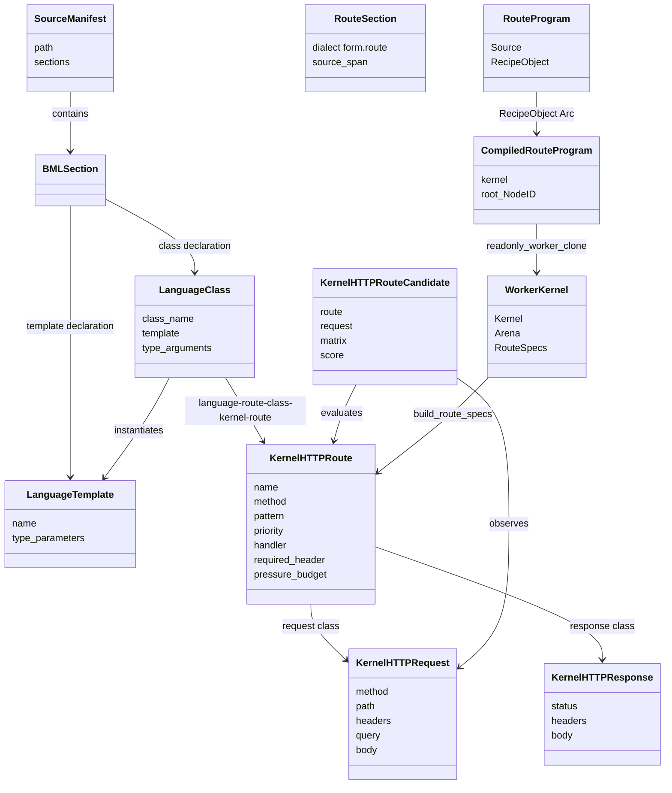

# Source-language-first kernel router architecture

The current working sheet lives in
[`SOURCE_LANGUAGE_KERNEL_ROUTER_TRACKING.md`](SOURCE_LANGUAGE_KERNEL_ROUTER_TRACKING.md). Keep that file
as the live picture of what works, what is tight, and what needs attention next.
This architecture file holds the design shape.

## Decision

Source languages become first-class authored surfaces for the kernel router and
HTTP pipeline. BML is the first exercised dialect, not the name of the runtime
model. Form recipes and cells remain runtime truth. Rust remains the host
boundary.

That gives each layer one job:

| Layer | Owns | Does not own |
|---|---|---|
| Source language | Route classes, request/response contracts, templates, generic route families, author-visible HTTP policy | Runtime identity or execution truth |
| Form | Lowered recipes, cells, NodeIDs, route closures, channels, attention and candidate selection logic | TCP sockets, process lifecycle, TLS, host file descriptors |
| Rust host | `form-kernel-rust serve`, worker pool, HTTP framing, upstream proxying, deadlines, binary read/write, opaque host calls | Source grammar, business routes, candidate scoring, route semantics |
| Python upstream | Tail routes not yet native, current FastAPI compatibility surface | The long-term front door |

The durable public claim is simple: a route is authored in a source language,
lowered through Form into content-addressed recipes and cells, and executed by
the kernel. Rust only hosts the request boundary and walks the Form closure.

## Realized — HTTP framing moved from Rust into Form (2026-06-04)

The kernel-minimal correction landed: the HTTP framing the layer table assigns to
Rust (parse, render, route, dispatch) now lives as a **BML class hierarchy in
Form**, Rust holding only sockets + eval/JIT. The stack, merged and proven:

- `http-parse.fk` (request lexer, CRLF-safe) · `kernel-http.fk` (the classes
  `kh-request`/`kh-response`/`kh-route` + the pressure-scored Router) ·
  `http-request.fk` (parse → `kh-request`) · `http-render.fk` (`kh-response` →
  wire, data-driven) · `http-server.fk` (`kh-serve`: parse→route→dispatch→render)
  · `http-socket.fk` (the Form-native accept-loop `kh-serve-listener`).

A request flows parse → Request → Router → dispatch → Response → socket, every
decision a named Form value; routes and handlers are DATA, the recipes pure flow.
Three-way proven (Go/Rust/TS) for the pure layers — render 63, request 31, server
31, parse 11 — and Go/Rust over a real socket (15). PRs #2453, #2454, #2455.

So the `KernelHTTP*` shapes and framing described below now live as `kh-*` Form
recipes — read the route-hierarchy, candidate-matrix, and HTTP-classes sections
as that realization. The layer table's Rust-owned "HTTP framing" row and the
gap-map still describe the pre-correction shape and reconcile on the next pass.
The remaining build step is the flip: `cli_serve` calling `kh-serve-listener`,
composting the Rust HTTP.

## Current runtime facts

The live body already has the pieces:

- `form/form-kernel-rust/src/main.rs::cli_serve` is an HTTP listener that loads a
  route manifest, owns a pool of worker-local `Kernel + Arena` instances, serves
  native handlers, and fans out unmatched paths to an upstream.
- `deploy/kernel-router/production-routes.fk` is the current production native
  route manifest. It binds `/health`, eleven `/api/utils/*` routes, and
  `/api/attention/kernel-runtime`.
- `form/form-stdlib/source-compiler.fk` owns `section [form.route]` lowering
  beside the existing `form.bml` and `form.action` high-level source dialects.
  Rust can invoke it at load time, but the grammar and lowering live in
  Form-stdlib, not in the router host.
- `scripts/runtime_surface_report.py --json` currently reads:
  - 785 API routes total.
  - 22 routes call the kernel from FastAPI, 2.8 percent of the API surface.
  - 0 routes are served kernel-first at the live front door.
  - 12 API routes are kernel-first capable in the router manifest.
  - 1,975 CPython code lines remain across the kernel router families, about
    89.8 lines per kernel-served route, plus 18 Python tail functions.
- The current capable API routes are:
  `/api/utils/coherence_weight`,
  `/api/utils/nodeid_distance`,
  `/api/utils/nodeid_compatibility`,
  `/api/utils/weighted_average`,
  `/api/utils/simpson_diversity`,
  `/api/utils/idea_score`,
  `/api/utils/marginal_cc_return`,
  `/api/utils/breath_balance`,
  `/api/utils/shannon_entropy`,
  `/api/utils/softmax_weights`,
  `/api/utils/grounded_value`,
  `/api/attention/kernel-runtime`.

The direction is runtime share, not route count. A route that calls
`serve_via_kernel` from FastAPI still leaves routing, binding, validation,
orchestration, and response serialization in CPython. A kernel-router native
route moves the whole request lifecycle for that route into Form.

## Target topology

```
client
  |
  v
form-kernel-rust serve
  |
  +-- native route present in source-authored manifest
  |     -> Form route cell
  |     -> worker-local Kernel + Arena
  |     -> response with X-Form-Router: native-kernel
  |
  +-- native route absent
        -> upstream FastAPI
        -> response with X-Form-Router: fanout-python
```

The source-authored manifest is the source entry. The runtime manifest is a
Form cell set with a top-level `routes` binding. `build_route_specs` consumes
path/closure rows and direct `KernelHTTPRoute` rows. The `KernelHTTPRoute` row
is the bridge: the authored language/Form layer owns method, pattern, priority,
required header, handler name, and pressure budget; Rust resolves the handler
name through the already-walked Form environment and carries the closure at the
host boundary.

## Routing flow axes

There is no separate class of "source route" versus "production route." There are
only route layers that eventually yield Form-native values.

Authoring/loading axis:

- A raw Form manifest is read as `.fk`, walked, and resolved into route values
  plus handler closures.
- A source-authored manifest runs through a source pipeline first. The current
  `section [form.route]` path uses the Form source compiler, but the requirement
  is only that the pipeline returns Form-native route values and handler
  recipes/closures.
- A text-first route can arrive as `.fk` source that the kernel reads and walks.
- A binary-first route can arrive as already-emitted Form recipe bytes loaded
  through Form binary readers when the route crosses a file, socket, process, or
  external-language boundary. Inside one process, an existing Form object graph
  should be carried by reference.

Request routing axis:

- A native route is a request that matches a Form route value and executes a
  Form closure in the kernel.
- A fanout route is a request whose Form route value is not present yet, so the
  host forwards it upstream.
- A local-control route is owned by the router boundary, such as health or
  local error responses.

Any additional layer is part of the route when it is expressed as Form-native
recipes, cells, or compiler-lens values. BML is a source surface. BMF is the
lens and translation layer. Form recipes and cells are the runtime truth. `.fk`
text and `.fkb` bytes are carriers, not the definition of the route.

## Route object hierarchy

Final design: the authored language creates high-level cells; the compiler lens
returns Form recipes; the router carries a compiled Form object graph by
reference; each worker walks that graph in an isolated kernel.



Current implementation anchors:

- `form/form-stdlib/source-compiler.fk` parses `template` and `class` lines in
  `section [form.route]` and returns Recipe objects through
  `fsc-compile-section-recipe`.
- `form/form-stdlib/language-model.fk` defines `LanguageTemplate`,
  `LanguageClass`, and `language-route-class-kernel-route`. Their runtime type
  tags are compact numeric IDs, not repeated type-name strings. BML is one
  dialect that can emit these cells; future grammars should emit the same model.
- `form/form-stdlib/kernel-http.fk` defines `KernelHTTPRequest`,
  `KernelHTTPResponse`, `KernelHTTPRoute`, and `KernelHTTPRouteCandidate`.
  Their value tags are numeric IDs (`43001`..`43007`) so the class hierarchy is
  carried compactly while route decision flow remains visible. `43007` is
  `KernelHTTPRouteDataRef`, the bridge from source-language route class flow
  into compact route table data.
- `form/form-kernel-rust/src/main.rs` stores the compiled object graph as
  `CompiledRouteProgram { kernel, root }` and carries it as
  `RouteProgram::RecipeObject(Arc<CompiledRouteProgram>)`.
- `build_worker_kernel` uses `readonly_worker_clone()` for that route program,
  walks the root `NodeID`, builds route specs, and `handle_request` invokes the
  selected Form closure.
- `deploy/kernel-router/production-routes.fk` authors `/health` as a BML
  `RouteCell<KernelHTTPRequest, KernelHTTPResponse>` template/class hierarchy.
  The `HealthRoute` class owns a readable `handle(request)` method and binds
  `route = route_data(health, handle);`, so method/path/priority/budget load
  from `deploy/kernel-router/production-routes-data.json` while handler flow
  stays in the class.

End-to-end request proof shape:

1. `serve --routes deploy/kernel-router/production-routes.fk --stdlib form-stdlib`
   sees a `section [form.route]` source entry.
2. The main thread calls the Form source compiler and receives a Recipe object
   `NodeID`, not lowered route text.
3. The compiled section object is imported into one `CompiledRouteProgram`
   kernel graph and stored behind `Arc`.
4. Each worker clones that object graph, walks the root, and resolves the
   top-level `routes` binding.
5. The `/health` request selects the source-authored `KernelHTTPRouteDataRef`,
   resolves it to a route spec, invokes the lowered `HealthRoute_handle`
   closure, and returns `X-Form-Router: native-kernel` with body `ok`.

What the hierarchy decides:

- `LanguageTemplate` proves the source has a generic route family.
- `LanguageClass` binds that family to request/response types and a route value.
- `KernelHTTPRouteDataRef` keeps route table data out of recipe source where a
  data carrier exists.
- `KernelHTTPRoute` is the executable route declaration the router can inspect
  after data refs are resolved.
- `KernelHTTPRouteCandidate` carries the multidimensional choice matrix
  (`method`, `path`, `header`, `budget`) and the score used by selection.
- `RouteProgram::RecipeObject` chooses the in-process object carrier instead of
  source reparsing or route serialization.

What changed in the second pass: `/health` route name, method, path pattern,
required header, priority, and pressure budget now live in a file-backed JSON
route-data carrier. The source recipe keeps class identity and handler flow. What
still does not fit the final bar: most production routes still use path/closure
rows, the type IDs are mirrored in Form and Rust instead of generated from one
registry, and the JSON carrier is host-decoded instead of exposed as a
Form-visible `KernelRouterConfig` cell.

## Source-Language Authoring Contract

A source route declaration lowers to two Form products:

1. A handler closure in the `routes` list consumed by
   `form-kernel-rust/src/main.rs::build_route_specs`.
2. A route cell carrying method, path, request class, response class, handler
   cell, source path, and migration state.

The route cell is the durable identity. The path string is an HTTP lookup key.

Rules:

- Source route declarations use registered Blueprint names. Unknown route,
  request, response, channel, or body class names fail through the existing
  registry discipline in `form/user-blueprint-registry.md` and
  `form/form-stdlib/form-ontology-loader.fk`.
- Generic parameters are authoring-time names for Form Blueprints and Recipe
  shapes. After lowering, no dialect-specific route object remains in the
  runtime.
- Source-language code can call Form functions directly where the dialect lens
  exposes them. The compiler does not introduce Python adapters.
- Generated response bodies must be byte-for-byte compatible with the existing
  HTTP contract before a route leaves the fan-out tail.

## Compiler Lens Contract

The compiler is part of the reasoning surface. It must expose the structure it
uses to lower BML, not only the lowered Form text.

`form/form-stdlib/compiler-lens.fk` defines the first BML-authored lens values:

| Value | Carries |
|---|---|
| `CompilerLensSurface` | surface name, grammar, abstraction level, human component, machine component |
| `CompilerLensSourceMap` | source surface, target surface, source span, target node, fidelity |
| `CompilerLensDependency` | owner, target, relation, strength |
| `CompilerLensTranslation` | source surface, target surface, direction, reversibility, lossiness |
| `CompilerLensDiagnostic` | severity, concept, source span, message, repair |
| `CompilerLens` | the surface plus its maps, dependencies, translations, diagnostics |

Every new source-language/BMF compiler step should produce two outputs:

1. Executable Form recipes/cells.
2. A compiler lens value that lets a human or agent inspect what changed, why it
   changed, what depends on it, and how to translate in the other direction.

That lens is how the compiler helps maintenance:

- Dependency edges tell us which route templates, request cells, response cells,
  and route handlers move when a class changes.
- Source maps let diagnostics point to the source-language concept, not only the lowered
  Form expression.
- Translation records keep BMF bidirectionality explicit: source to Form, Form
  to source, and cross-surface movement are all ordinary lens directions.
- Human and machine components travel together, so a surface can be readable
  for us and precise for the kernel at the same time.
- Structure scoring gives attention a measurable way to prefer high-level concepts
  that preserve intent over lower-density positional route lists.

The BML compiler-lens bridge now links to existing BMF contract values through:

- `CompilerLensBmfSurfaceLink`
- `CompilerLensBmfLensLink`
- `CompilerLensBmfAlignment`

Those links preserve the referenced BMF surface and lens contracts as Form
values. Structural validators compare the linked contract's domain, lens, and
surface against the expected BMF identities, so the compiler lens can reject a
mismatched translation instead of only describing one.

## Working goal and exit criteria

Current goal: make source languages plus BMF live authored lenses for
kernel-first HTTP, with Form as runtime truth and Rust as the host boundary.
New work is aligned when it moves a route, compiler step, channel, or
measurement closer to this loop:

```
source language
  -> BMF compiler lens with source maps and contract links
  -> Form recipes, cells, routes, channels, attention values
  -> kernel execution
  -> live observations
  -> BMF reverse or alternate lens back to source surfaces
```

Valid exit criteria for the next delivery slice:

1. A gap is named with exact code references and classified as aligned,
   side-quest, or temporary friction.
2. At least one aligned gap is closed in BML/Form/Rust host code or a
   load-bearing architecture contract.
3. The closure is validated by real computation across the available Form
   kernels or by a live router measurement, not by mock values.
4. The result preserves information fidelity: matrices, contract values,
   source maps, response shapes, or channel payloads stay structured until a
   lower-dimensional projection is required by an existing boundary.
5. The next gap has a measurable exit criterion and an explicit answer to:
   "does this move source languages/BMF toward live, bidirectional, measurable kernel
   execution?"

Current gap map:

| Gap | Alignment | Exit criterion |
|---|---|---|
| Runtime grammar discovery does not emit compiler-lens evidence | Aligned | Loading a runtime grammar plugin derives one `CompilerLensBmfAlignment` with source/form surface links and parse/emit translations from the resolved binding. |
| Source compiler writes lowered output without compiler-lens source maps | Aligned | Each compiled section yields a `CompilerLensSourceMap` whose span matches the source range and whose target node matches the compiled section node. |
| Source-language route authoring now has readable template/class blocks | Aligned | `section [form.route]` supports `template RouteCell<TRequest, TResponse> { member ... }` plus `class ... { def handle(...) { ... } route = route_data(...); }` and lowers that hierarchy to `LanguageTemplate`, `LanguageClass`, and executable handler closures. |
| Router selection is `KernelHTTPRoute`-aware and exposes the selected candidate as Form tissue | Aligned | `serve` carries `KernelHTTPRoute` rows, honors method mismatch, wildcard path, priority, required headers, and pressure budget, and passes selected `KernelHTTPRouteCandidate` plus pressure rows into native handler context. |
| Native handler input carries both compatibility alist and typed request tissue | Aligned | A native route receives `__kernel_request__` as `KernelHTTPRequest(method, path, headers, query, body)` with typed header and field rows while existing alist handlers keep serving current routes. |
| Native handler output can return `KernelHTTPResponse(status, headers, body)` | Aligned | `serve` emits exact status/header/body for a non-200 native route, including `Content-Type` and filtered end-to-end headers, while preserving the older status-only `respond` shape. |
| Native socket channels do not yet carry typed recipe bytes | Aligned | A BML/Form channel abstraction round-trips `recipe_to_bytes -> send -> recv -> bytes_to_recipe` without string loss. |
| Router measurements are path-count only and process-local | Aligned | `/api/attention/kernel-runtime` reports per-path count, latency, status/error, bytes, native/fanout split, and candidate ranking from live traffic. |
| Production route manifest is mixed: `/health` is `form.route` `RouteCell`-authored, utility routes remain Form-authored | Temporary friction | Convert the next route only when a source pipeline returns the same Form-native route values and handlers and serves identical responses with source entry observability. |
| JIT/native optimization | Side-quest | Defer until endpoint promotion is blocked by recipe-walk speed rather than HTTP/request/response shape. |

## HTTP classes

| HTTP class | Native input shape | Native response shape | Current gate |
|---|---|---|---|
| `QueryJson` | Query alist, decoded by `parse_request_line` | JSON text from Form, `Content-Type: application/json` | Active for promoted `/api/utils/*` routes |
| `FormPostJson` | Query alist plus `application/x-www-form-urlencoded` body pairs from `parse_request_body` | JSON text or scalar text | Ready for routes whose body is flat form data |
| `RawJsonBody` | Query alist plus raw `__body__` string | JSON text | Ready for body length and raw-string handlers |
| `StructuredJsonBody` | JSON body parsed to Form records/cells | JSON text from Form records/cells | Gate: structural JSON-to-Form marshalling |
| `HeaderAware` | Query/body alist plus typed request header cells | JSON/text | Gate: native handler header map; fan-out already forwards headers |
| `StreamOrSse` | Channel-backed message stream | chunk/SSE response | Gate: channel-to-HTTP streaming class and backpressure |
| `HostEffect` | Request cell plus declared host port | JSON/text plus audit trace | Gate: explicit port cell, idempotence class, failure transcript |
| `FanoutTail` | Full HTTP request to upstream | Upstream response relayed | Active for unmatched routes |
| `LocalControl` | Router-owned context only | text/JSON control response | Active for `/health` and router-local errors |

The first class to migrate is `QueryJson` because it has the smallest
marshalling surface and the current production manifest already carries it.
`StructuredJsonBody`, `StreamOrSse`, and `HostEffect` are real runtime classes,
not reasons to keep all routing in Python.

## Router generics and templates

The route source language owns reusable route shapes. Other dialects can emit
the same route template cells. The minimum template set is:

| Route template | Lowers to | Use |
|---|---|---|
| `Route<Method, Path, Request, Response>` | `RouteCell` plus `(path, handler)` | Base route identity |
| `QueryJson<Path, QueryCell, ResponseCell>` | `Route<Query.GET, Path, QueryCell, JsonResponse>` | `/api/utils/*` family |
| `FormPostJson<Path, FormCell, ResponseCell>` | `Route<Query.POST, Path, FormCell, JsonResponse>` | Flat body posts |
| `RawJsonPost<Path, BodyCell, ResponseCell>` | `Route<Query.POST, Path, RawBody, JsonResponse>` | Raw JSON body handlers |
| `AttentionRoute<Path, MetricsCell, ResponseCell>` | Route over router context metrics | `/api/attention/kernel-runtime` |
| `ChannelRoute<Path, MessageCell, AckCell>` | Route over `CHANNEL-MSG` payloads | request/agent transport surfaces |

Template expansion happens in Form-stdlib, not Rust. Rust sees only lowered Form
source and a `routes` binding. Template names, request classes, and response
classes become cells so candidate selection and runtime telemetry can query the
route surface by shape rather than by filename.

## Telemetry contract

Every response already carries the top-level route verdict:

- `X-Form-Router: native-kernel`
- `X-Form-Router: fanout-python`
- `X-Form-Router: native-kernel-error`
- `X-Form-Router: local-control`

Native handlers also receive router context pairs prepended to the request
alist:

- `__request_method__`
- `__request_target__`
- `__request_path__`
- `__router_native_route_count__`
- `__router_observed_path_count__`
- `__router_observed_native_route_count__`
- `__router_observed_fanout_path_count__`
- `__router_total_requests__`
- `__router_native_requests__`
- `__router_fanout_requests__`
- `__router_local_control_requests__`
- `__router_native_error_requests__`
- `__router_upstream__`, `__router_upstream_host__`,
  `__router_upstream_port__`, `__router_upstream_base_path__`

The durable observation cell is `__router_observation__`. It is a Form dict with:

- `fanout_path_counts`: rows shaped as `{path, count, source}` sorted by request
  count descending and path ascending.
- `next_bml_candidate`: the current route candidate shaped as
  `{path, count, source}`.

The flat `__router_next_bml_candidate_*` keys may stay during the branch for
compatibility with scalar handlers, but the BML architecture reads the structured
observation cell.

The authored BML layer must not duplicate those counters. It reads them through
Form, projects them through `form/form-stdlib/attention.fk`, and emits route
attention records. `scripts/runtime_surface_report.py` remains the route-share
readout. `scripts/kernel_attribution_report.py` remains the recipe/cell activity
readout. The public telemetry headline is:

```
kernel-first served routes / total routes
kernel-first capable routes / total routes
request share by X-Form-Router
CPU-time share by X-Form-Router
top observed fan-out path by request count
```

## Candidate selection matrix

Candidate selection is a Form route over measured runtime facts. BML authors the
policy surface; Form computes the score.

| Signal | Source | Weight |
|---|---|---:|
| Request share | `X-Form-Router` access logs and router counters | 0.25 |
| Existing kernel recipe coverage | `scripts/kernel_attribution_report.py` route data | 0.20 |
| Request class readiness | HTTP class table above | 0.15 |
| Response fidelity readiness | byte-for-byte body and content-type comparison | 0.15 |
| Host-boundary cleanliness | no new Rust semantics, explicit ports only | 0.10 |
| Rollback simplicity | removing one route binding returns to fan-out | 0.10 |
| Runtime payoff | native latency and CPython lifecycle avoided | 0.05 |

Selection bands:

| Score | Action |
|---:|---|
| 85-100 | Author source route and add it to the native manifest |
| 70-84 | Author source request/response cells, keep route fanned out until one gate closes |
| 50-69 | Keep in fan-out tail, add telemetry and route shape metadata |
| 0-49 | Keep in Python upstream; revisit when runtime data changes |

Hard stops override the score:

- Native response cannot match status, body, and content type.
- Request requires structured JSON and the route has no structural body cell.
- Route depends on streaming/SSE without a channel-backed HTTP class.
- Route performs host effects without a declared port cell and audit trace.
- Route requires native header access before `HeaderAware` lands.

## Channels

Channels are Form recipes, not sidecar queues. The existing carrier is
`form/form-stdlib/channel.fk`:

- `CHANNEL-V0` holds ordered `CHANNEL-MSG` children.
- `channel-message` wraps a payload recipe.
- `channel-append` writes the next channel state.
- `channel-read` and `channel-read-since` read message recipes.
- `form/form-stdlib/tests/channel-bml-band.fk` shows BML-authored code calling
  the channel transport functions.

The router uses channels for three concrete flows:

1. Candidate flow: observed fan-out path events become `CHANNEL-MSG` payloads
   carrying path, method, count, request class, response class, and time window.
2. Attention flow: `/api/attention/kernel-runtime` projects router counters into
   attention axes and writes route-attention cells.
3. Agent/runtime flow: request-side or agent-side messages cross as content-
   addressed payloads before they become HTTP streaming classes.

`CHANNEL-V0` is single-writer and whole-file rewrite. That is enough for local
candidate and attention channels. Multi-writer or durable streams require a
stronger channel class before they can carry public streaming HTTP.

## Host-boundary constraints

Rust may:

- accept TCP connections and frame HTTP/1.1 responses;
- parse method, path, query, headers, and body into the current request alist;
- enforce host-level size and deadline boundaries;
- maintain worker-local `Kernel + Arena` instances;
- load raw Form source and in-memory Recipe object graphs;
- call the Form source compiler when a BML section is supplied;
- proxy unmatched requests to the upstream with header hygiene;
- expose measured router context to Form handlers.

Rust may not:

- implement BML grammar or route templates;
- choose migration candidates;
- encode business response shapes;
- know route-specific validation beyond generic HTTP classes;
- call databases or services except through declared host ports;
- add native handlers that bypass Form cells;
- decide that a path is native except by the loaded Form route manifest.

This preserves the host boundary. If a route needs new meaning, the new meaning
lands as BML/Form. If a route needs a new host capability, Rust exposes the
smallest opaque port and Form owns the policy around it.

## Configuration and minimum surface

Current configuration lives in three places:

| Config | Current format | How the kernel reads it | Target |
|---|---|---|---|
| Listener and front-door wiring | CLI args: `--host`, `--port`, `--workers`, `--routes`, `--stdlib`, `--upstream` | `cli_serve` parses arguments before binding sockets or compiling routes | Keep host/process wiring at the Rust boundary, but allow a single Form router config cell to own semantic policy. |
| Route surface | `.fk` manifest with optional `section [form.route]` blocks | Raw Form manifests go through `read_root_from_source`; source sections call `fsc-compile-section-recipe` and become `CompiledRouteProgram` object graphs | Route config is source-language/Form cells: classes, templates, request/response contracts, handlers, and source maps. |
| Host defaults | Rust constants for keep-alive, fanout deadlines, and request/response shape limits | Functions such as `fanout_connect_timeout`, `fanout_read_timeout`, `request_shape_limit`, and `response_shape_limit` return constants | Lift tunable policy into `KernelRouterConfig` as a Form value; keep only emergency host ceilings in Rust. |
| Canonical numeric formats | Repository JSON file at `docs/coherence-substrate/numeric-formats.canonical.json` | `form/form-kernel-rust/src/formats.rs` resolves the in-repo file path from `CARGO_MANIFEST_DIR` | Keep as file-backed substrate config; expose the loaded format table as Form-visible facts where route math depends on it. |

No environment variable is part of the live kernel-router configuration surface.
If a value should vary by deployment or route, it should become a config file or
Form/BML cell that the kernel can observe.

Absolute minimal kernel surface:

1. Host socket boundary: accept TCP, read/write HTTP frames, enforce finite
   resource ceilings, and proxy unmatched paths through one explicit upstream
   port.
2. Object substrate: intern recipes/cells, hold `NodeID` identity, clone/import
   Form object graphs, and walk recipes in worker-local `Kernel + Arena`.
3. Language bridge: call a registered compiler/lens entry and receive Form
   objects; the kernel must not know route grammar beyond detecting that a source
   section exists until section detection itself is lifted.
4. Observation boundary: expose request facts, selected route candidate, and
   router counters as Form values.

Shrink candidates:

| Surface | Why it is too large now | Desired shrink |
|---|---|---|
| Rust `section [` scanning | Rust knows a source-grammar marker. | Move manifest section discovery into a Form/BMF loader that returns object roots and lens diagnostics. |
| Rust route-language prelude list | The host decides which language support files define BML routing. | Make prelude dependencies part of a Form-visible compiler/lens registry loaded from config. |
| Compatibility alist marshalling | The host still passes the old alist as the one handler argument, with `__kernel_request__` nested inside it. | Make `KernelHTTPRequest` the primary handler argument for typed routes and keep the alist only as an explicit projection. |
| Native response body carrier | The host now honors `KernelHTTPResponse(status, headers, body)`, but the body is still a buffered string. | Add typed body cells and streaming body carriers while keeping router-owned framing explicit. |
| Per-worker full graph clone | Correct and serialization-free, but duplicates read-only route graph memory. | Keep worker-local mutable state while sharing immutable recipe graph structure, or add copy-on-write graph overlays. |
| Fanout policy constants | Host defaults are fixed and invisible to Form attention. | Move deadline and shape policy into `KernelRouterConfig` cells with host ceilings as last-resort guardrails. |

## Migration gates

Every route moves through the same gates:

1. Authoring gate: a source or lens route declaration returns a Form handler and
   route cell. The current source-language route path compiles source sections to Form
   Recipe objects and carries the compiled object graph by reference inside the
   process; `.fk` text and `.fkb` files remain carriers at boundaries, not
   requirements.
2. Identity gate: the request class, response class, handler, source path, and
   route path are queryable as cells with registered Blueprints.
3. HTTP gate: native status, content type, headers that matter, and body match
   the upstream contract for representative and edge inputs.
4. Runtime gate: native route emits `X-Form-Router: native-kernel`; removing its
   route binding returns the path to `fanout-python`.
5. Telemetry gate: runtime-surface data shows served/capable counts, request
   share, and the route's candidate score.
6. Host gate: no BML grammar, route semantics, or business validation lands in
   Rust.
7. Channel gate: streaming, agent, or async flows use Form channel classes before
   they are native HTTP classes.

The first migration batch is the currently capable set in
`deploy/kernel-router/production-routes.fk`. The second batch is the remaining
kernel-served `/api/utils/*` routes whose Python wrappers still own the HTTP
lifecycle. Structured-record routes wait for `StructuredJsonBody`.

## Public stance

BML is the authored surface because humans need a strong language for route
classes, generics, contracts, and migration policy. Form is the runtime truth
because recipes and cells carry identity, equivalence, and execution. Rust is
the host boundary because sockets, worker pools, deadlines, and file descriptors
belong at the edge.

The architecture is complete when the headline changes from:

```
22/785 routes call the kernel from CPython; 0 are kernel-first served.
```

to:

```
Source-language route cells front live HTTP traffic through the Form kernel;
CPython is the measured fan-out tail.
```
